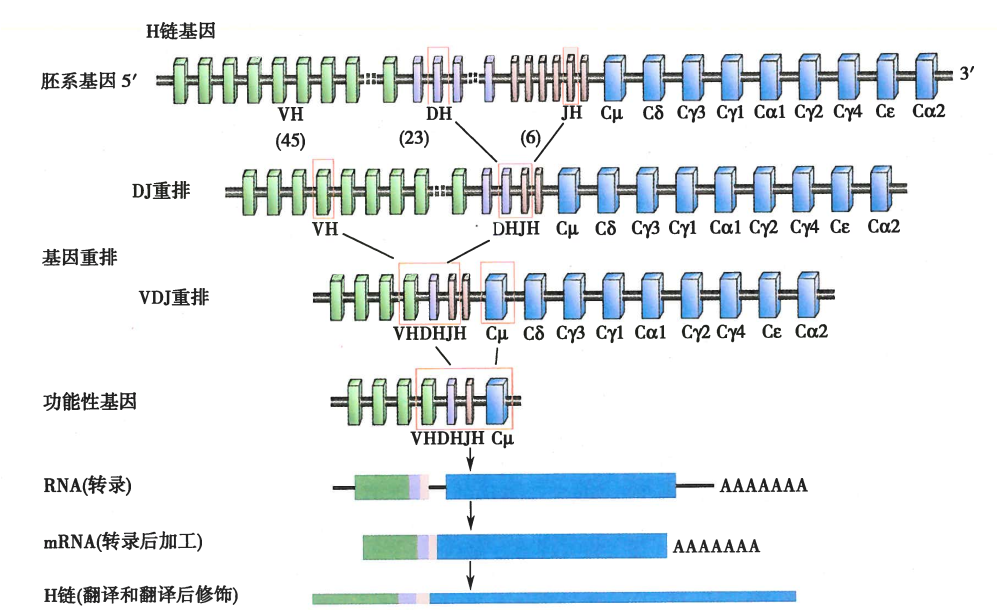
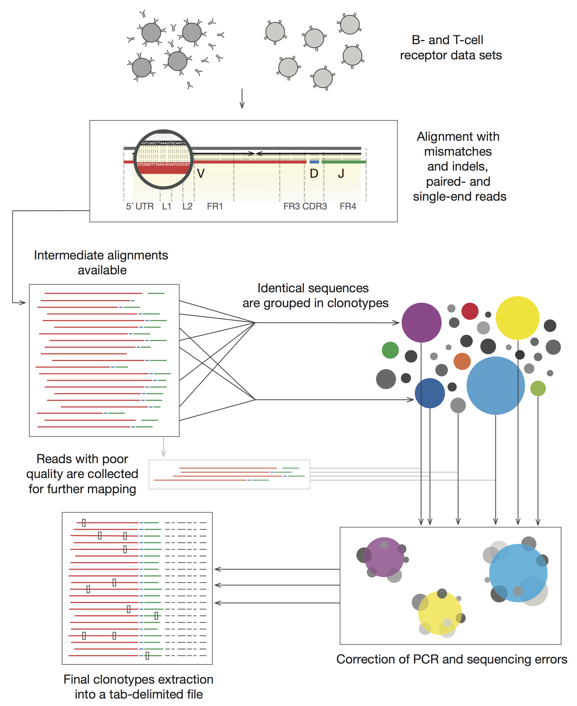
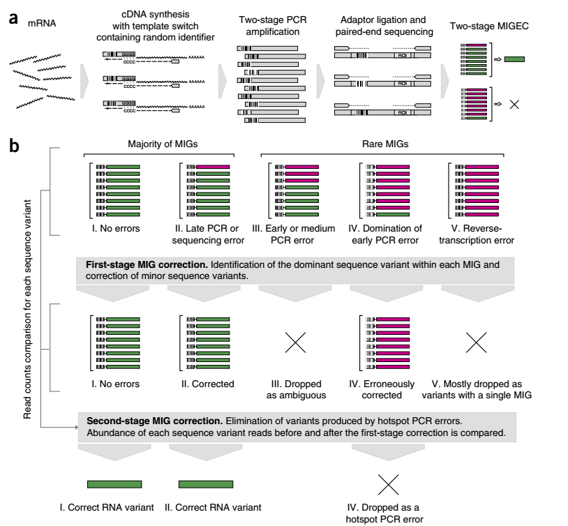
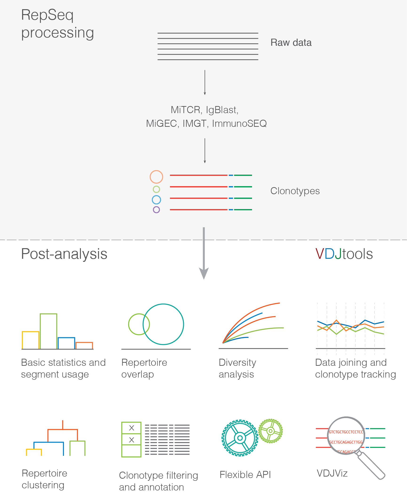
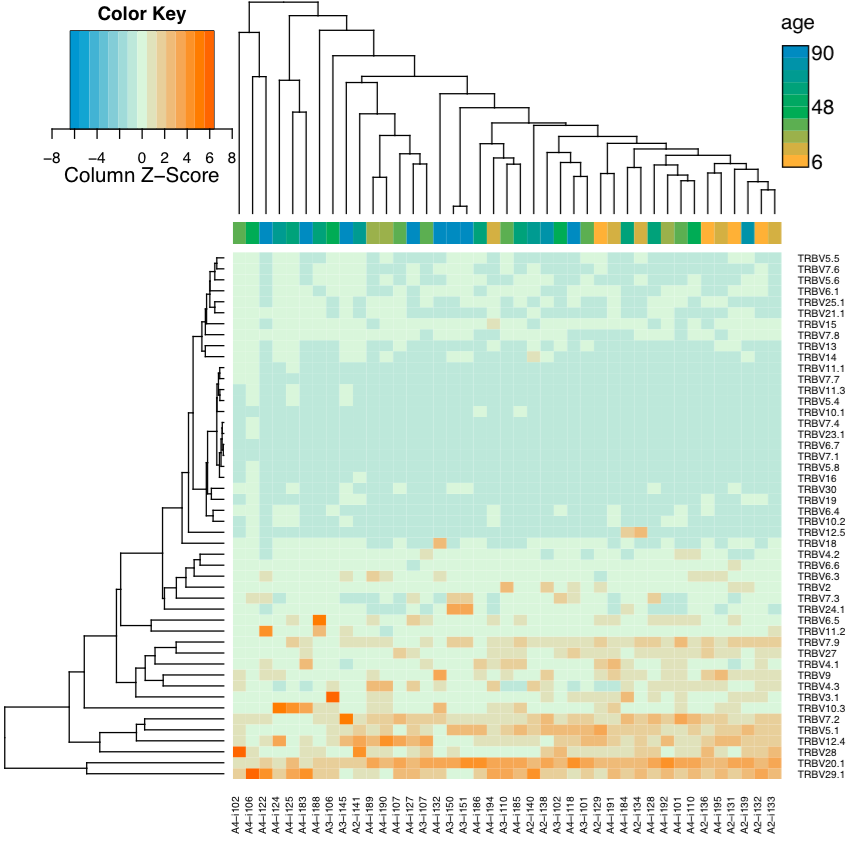

<a name="content">目录</a>

[免疫组库入门](#title)
- [背景介绍](#introduction)
    - [适应性免疫应答过程](#the-process-of-adaptive-immune-response)
        - [免疫细胞的发生与成熟过程](#the-development-of-lymphocyte)
    - [免疫组库测序技术](#the-technology-of-immune-repertoires-sequencing)
- [仅考虑CDR3区域](#analysis-CDR3-region)
   - [CDR3区域结构鉴定](#structure-identification-of-cdr3-region)
        - [标准结构鉴定方法](#standar-methods-for-structure-identification)
        - [标准结构鉴定方法存在的问题及解决策略](#error-in-struture-identification-and-methods-to-overcome)
    - [一些描述样本免疫组库的指标](#index-for-characterize-individual-immune-repertoire)
    - [PCR与测序错误的校正](#pcr-and-sequencing-error-correction)
    - [缩小多重PCR引入的PCR bias](#multiplex-pcr-bias-minimization)
    - [健康个体的免疫组库](#properties-of-a-healthy-repertoire)
    - [对低丰度的T细胞克隆具有极高的灵敏度](#ultra-sensitive-detection-of-rare-T-cell-clones)
- [考虑CDR3区域和恒定区域](#analysis-CDR3-and-constant-region)
- [TCR/BCR的基础分析及分析工具](#basic-analysis-and-analysis-tools)
    - [VDJtools](#vdjtools)
        - [功能](#functions-of-vdjtools)
            - [简要概览](#simple-outline-of-functions)
            - [详细举例](#details-for-individual-function)
                - [Basic analysis](#basic-analysis)
                - []
        - [使用](#usage-of-vdjtools)
        - [典型示例](#typical-examples)


<h1 name="title">免疫组库入门</h1>

<a name="introduction"><h2>背景介绍 [<sup>目录</sup>](#content)</h2></a>

<a name="the-process-of-adaptive-immune-response"><h3>适应性免疫应答过程 [<sup>目录</sup>](#content)</h3></a>

<a name="the-development-of-lymphocyte"><h4>免疫细胞的发生与成熟过程 [<sup>目录</sup>](#content)</h4></a>

- B细胞

    （1）抗原非依赖期

    B细胞在骨髓中的分化发育过程不受外来抗原影响，称为B细胞分化的**抗原非依赖期**

    基因重排过程：

    

    一个B细胞克隆只表达一种BCR，只分泌一种抗体，原因：

    > - 等位排斥：B细胞一条染色体的重链基因重排成功后，会抑制同源染色体上重链基因的重排；
    >
    > - 同种排斥：$\kappa$轻链基因重排成功后会抑制$\lambda$轻链基因的重排；

    B细胞中枢免疫耐受的形成——**阴性选择**

    > 前B细胞在骨髓中发育至未成熟B细胞后，期表面只表达完整的mIgM，此时若mIgM与自身抗原结合，会面临三种命运：
    >
    > - 细胞凋亡，克隆清除；
    > - 通过受体编辑改变其BCR的特异性；
    > - mIgM表达下调，仍然能进入外周免疫器官，但对抗原刺激不发生应答，称为“失能”；

    （2）抗原依赖期

    B细胞在骨髓微环境诱导下发育成初始B细胞，离开骨髓，到达外周免疫器官的B细胞区定值，在那里接受外来抗原的刺激而活化、增值，进一步分化为成熟的浆细胞和记忆B细胞

- T细胞

    TCR异二聚体的α和β链由可变区（V）和恒定区（C）组成，它们在胸腺发育过程中被拼接在一起，从而产生由每种T表达的单一类型的功能性TCRαβ复合物细胞

    β链的V区由可变（V），多样性（D）和连接（J）基因片段编码，而α链的V区由V和J基因片段编码

    TRB的候选基因片段数量：

    - TRBV：42
    - TRBD：2
    - TRBJ：12

    TRA的候选基因片段数量：

    - TRAV：43
    - TRAJ：58


<a name="the-technology-of-immune-repertoires-sequencing"><h3>免疫组库测序技术 [<sup>目录</sup>](#content)</h3></a>

TCR与BCR的结构：

<table>
<tr>
	<td><p align="center"></p></td>
	<td><p align="center"></p></td>
</tr>
</table>

TCR与APC的互作：

<p align="center"></p>

<p align="center">(a)(b) TCR与APC的互作; (c)T细胞中的VDJ基因重排</p>

CDR3区域：

>  互补决定区域（complementarity determining region 3 (CDR3) domain），一般长度为45nt，有VJ junction形式（TCR-α）和VDJ junction形式（TCR-β）

材料选择：用αβ还是γδ？

> TCR有 αβ（外周血中90%~95%）和 γδ（外周血中5%~10%）二聚体形式，一般对TCR的研究都是针对占主体的αβ二聚体形式，且α的CDR3区域是VJ junction，β的CDR3区域是VDJ junction，所以β链与α链相比具有更多的组合形式和连接的多样性，因此TCR-seq一般都是针对β链的CDR3区域

材料选择：用DNA还是RNA？

> DNA
> - 优点：丰富，容易提取且能保持长时间的稳定，且对于每一个TCR subunit，一个细胞只有两个位置有，或者说只有固定的两份拷贝，因此DNA模板分子的数量能反映T细胞的数量
> - 缺点：必须进行PCR扩增来达到足够的测序量，而为了得到进尽可能全的TCR库的组成，使用了多套PCR引物多重PCR方法，使得很容易在PCR过程中引入PCR bias
> 
> RNA
> 
> 使用5' RACE方法进行cDNA的扩增，因此只需要使用一套PCR引物即可
> - 优点：只使用一套PCR引物，极大地降低了PCR bias
> - 缺点：TCR表达水平的变异很大，不能准确地反映T细胞的数量

详尽彻底的测序不是T细胞库分析的目标（也不现实，因为目前免疫组库基本都是从外周血取样，而要想实现彻底的测序，即意味着将这个个体外周血中的免疫细胞克隆型几乎全部取样到，除非将这个人的血几乎抽干，才可能实现），对于旨在阐明样本间差异的比较研究，极端深的TCR-seq也是没有必要的。对应TCR-seq来说，人们主要关心的是：**当取样不完整，测序深度差异比较大时，怎么鉴定一个给定的样本它的TCR组成与其他的样本不同？**

可以计算一个**置信度（confidence)**，来表示一个克隆在给定样本中差异于另一个样本是偶然产生的概率，概率越低则说明越不可能是由于偶然因素导致的，也就是说是真实的差异的可能性比较大

为了能够将两个或多个样本进行比较，需要先将它们的input data进行标准化处理：

> - 以多个样本中的数据量**最少的那个样本为基准**，对其他样本的reads进行无偏好的随机抽样，将它们的input data砍到同一水平 —— 这是在**生态学**研究中常用的方法
> 
> 这是目前免疫组库测序领域常用的标准化方法，但是该标准化方法是否合理？是否还有其他可选的方法？

比较样本间差异或相似度的几个指标：

- **Simpson diversity index**：样本间的多样性的比较
- **Morisita-Horn similarity index**：样本间相似度的比较

<a name="analysis-CDR3-region"><h2>仅考虑CDR3区域 [<sup>目录</sup>](#content)</h2></a>

<a name="structure-identification-of-cdr3-region"><h3>CDR3区域结构鉴定 [<sup>目录</sup>](#content)</h3></a>

<a name="standar-methods-for-structure-identification"><h4>标准结构鉴定方法 [<sup>目录</sup>](#content)</h4></a>

基本上就是基于与germline的V、D、J基因片段进行比对来鉴定，比对方法有基于Smith-Waterman算法的，有基于seed-and-vote方法的，也有基于BLAST的

鉴定出的CDR3区域的解构如下图：


<a name="error-in-struture-identification-and-methods-to-overcome"><h4>标准结构鉴定方法存在的问题及解决策略 [<sup>目录</sup>](#content)</h4></a>

由于在原始的重组过程中发生了三次随机事件：

> - V、D、J基因片段的随机选择；
>
> - 在V基因片段的末端，D基因的两端以及J基因的起始端的随机删除；
>
> - 在VD与DJ重组片段之间的非模板依赖性的随机插入；

这使得按照标准的结构鉴定方法鉴定出的结果会存在系统偏差：

> 某一个检测到的CDR3序列，可能由多种重组方式得到，而基于序列比对方法的结构鉴定倾向于选择尽可能长匹配 germline 基因片段，来作为最优重组来源的片段，但是最长的匹配并不意味着一定是最可能的重组方式

最好的方式是将所有可能的潜在重组形式列出来，然后计算出每种重组形式的似然，而似然的计算可以基于从测序数据中学习得到的概率模型算出


<a name="index-for-characterize-individual-immune-repertoire"><h3>一些描述样本免疫组库的指标 [<sup>目录</sup>](#content)</h3></a>

- **个体免疫多样性** (immunological diversity)

	采用信息论中的香农指数

	$$H=-\sum_i^{|S|}p(c_i)\log p(c_i)$$

	其中，$S$表示该样本total unique clone的集合$S=\{c_1,c_2,...,c_m\}$

- **个体免疫组库采样的饱和度**

	采用了生态学中常用的 Chao1 指数，它常被用作种群丰富度的一个描述指标

	想象一下这样一个场景：

	> 在一个放了各种各样玩具模型的水池中（水池很大，其中玩具有相同的，有不同的，且各种类型及数目不限），随机来捞玩具。这时捞起来一个，发现之前有个玩具和这个捞起的玩具一模一样，这时有两个这种玩具在手上，这个玩具模型就是**doubletons**；当然也可能捞起一个玩具发现手里没有相同的，那这个就叫**singletons**

	那么经典的chao1指数的计算公式是这样的：

	$$S_{chao1}=S_{obs}+\frac{F_1^2}{2F_2}$$

	$S_{obs}$表示样本中观察到的物种数目。$F_1$和$F_2$分别表示singletons和doubletons的数目

	由经典公式可以看到，当doubletons为0（即$F_2$为0）时计算的结果没有意义，因此又提出了另外一种修正偏差的公式

	$$\hat S_{chao1}=S_{obs}+\frac{F_1(F_1-1)}{2(F_2+1)}$$

	可以这样理解这个修正公式（虽然不太严格）：它从singletons中拿出1条来（严格来说与经典公式相比还不到1条），当作doubletons，这样分母一定会大于0

	理解chao1指数的含义：

	> chao1指数是用来反映物种丰富度的指标
	>
	> 它通过观测到的结果推算出一个理论的丰富度，这个丰富度更接近真实的丰富度——一般来讲能观测到的物种丰富度肯定会比实际少，那么两者之间的差距有多大呢？
	>
	> chao1指数给出的答案是 $(F_1^2)/(2F_2)$，它通过singletons和doubletons进行了合理的推算，那么差距为 $(F_1^2)/(2F_2)$ 的合理性在哪里？
	>
	> 分析 $(F_1^2)/(2*F_2)$ 我们不难发现它对singletons的权重要高于doubletons (即 $F_1^2$ 比 $2F_2$ 变化的速度更快)，这和我们的一个直观理解是相符的：
	>
	> 在一个群体中随机抽样，当稀有的物种 (singletons) 依然不断的被发现时，则表明还有一些稀有的物种没有被发现；直到所有物种至少被抽到两次 (doubletons) 时，则表明不会再有新的物种被发现

	可以通过比较chao1指数和实际检测到的unique克隆数进行比较，来评估当前样本的测序饱和度

<a name="pcr-and-sequencing-error-correction"><h3>PCR与测序错误的校正 [<sup>目录</sup>](#content)</h3></a>

测序错误的影响及处理方法：

> TCR-seq对测序错误十分敏感，因为只要有一个碱基不同，一条TCR β链就能区别于其他的克隆，一个碱基的测序错误可能在后续的分析中会被错误地鉴定出一个低丰度的新克隆，因此
> 
> **（1）** 在进入后续分析之前需要执行严格的质控，但是 **（2）** 对于深度的TCR-seq则没有这个必要，因为错误的TCR序列总是表现出低丰度的特征，因此通过一个丰度的阈值筛选就可以比较轻松且准确地将这些错误的TCR克隆过滤掉；还有另外一种解决方法 **（3）** 假设每一种低丰度的克隆都是由测序错误产生的，将它们分别与高丰度的克隆依据序列相似性进行聚类，将高丰度的克隆的序列作为它的正确的序列

- 基于计算方法的校正

（1）Wei Zhang等提出了一种进行错误校正的方法

可分为三步进行，前两步进行测序错误的校正，最后一步进行PCR错误校正：

> （1）将reads根据测序质量分成三组：
>
> 	> - 高质量序列：每个碱基的质量都大于Q20；
> 	> - 丢弃序列：超过5个碱基的质量低于Q20，将这样的reads直接丢弃；
> 	> - 低质量序列：减去前两组，剩下的那些序列；
>
> （2）将低质量的序列比对到高质量的序列上，若某条低质量序列能比对到这样一条高质量序列：mismatch数不超过5个碱基，且都落在低质量位点上，则依据高质量序列对mismatch位点进行修正，否则丢弃这条低质量序列；
>
> （3）最后，为了消除PCR过程中引入的错误，将低丰度的reads比对高丰度reads，对于某一个低丰度reads，若能找到一条高丰度reads使得它们之间的mismatch低于3个碱基，则将它合并到对应高丰度reads中；

（2）Bolotin D等开发的MiXCR的错误矫正方法也同时考虑了PCR错误与测序错误：




简单来说：

校正测序错误的方法与上面的相同：用高质量的序列来校正低质量序列的低质量碱基

校正PCR error依据这样一个假设：

> PCR错误一般出现在PCR的比较靠后的阶段，如果共进行了N轮PCR，对于某一条template read，在这N轮PCR过程中总共发生了n次PCR错误（假设每次PCR错误只发生一个碱基错误且每轮最多只发生一次），PCR错误既可能发生在原始的template read上，也可能发生在已经发生PCR错误的read上，我们可以用一个树形结构来记录这条template read的PCR错误的发生进程（称为变异发生树）
>
> 
>
> 越靠近叶节点则错误发生得越晚，则这次错误得到的衍生序列的拷贝数就会越少

基于这样的现象，如果我们能基于测序的reads构建出一系列这样的变异发生树，则我们就可以得到进行PCR扩增之前的原始read以及其真实的丰度（原始read以及各种变异衍生reads丰度的累计丰度）

- 基于实验技术的方法




<a name="multiplex-pcr-bias-minimization"><h3>缩小多重PCR引入的PCR bias [<sup>目录</sup>](#content)</h3></a>

一般PCR仅应用一对引物，通过PCR扩增产生一个核酸片段，而多重PCR (multiplex PCR)，又称多重引物PCR或复合PCR，它是在同一PCR反应体系里加上二对以上引物，同时扩增出多个核酸片段的PCR反应，其反应原理，反应试剂和操作过程与一般PCR相同·

在免疫组库建库的过程中一般都采用针对V和J基因的多套引物进行PCR扩增，即使用的是多重PCR方法，与普通PCT相比，多重PCR明显会带来更大程度的PCR bias，所以为了保证下游分析的可靠性，进行PCR bias的修正是非常有必要的

Wei Zhang等提出了一种进行PCR bias修正的方法：

该方法基于这样一个前提假设：multiplex PCR过程中，克隆的扩增效率仅受到以下两个因素的影响——**模板的浓度**和**多重引物的效率**

基于上面的假设，研究人员做了以下实验来探究这些因素之间的关系：

按照下表列出来的引物对应克隆配比，将33套PCR引物（足量）加入到3对样本中

|	Plasmid No.	|	V gene	|	J gene	|	Plasmidmix 1-1*	|	Plasmidmix 1-2*	|	Plasmidmix 2-1*	|	Plasmidmix 2-2*	|	Plasmidmix 3-1*	|	Plasmidmix 3-2*	|
|:---:|:---:|:---:|:---:|:---:|:---:|:---:|:---:|:---:|
|	C-01	|	TRBV10-1	|	TRBJ2-7	|	2000	|	2000	|	10	|	10	|	100000	|	100000	|
|	C-02	|	TRBV10-2/3	|	TRBJ2-7	|	2000	|	2000	|	1000	|	1000	|	1000	|	1000	|
|	C-03	|	TRBV11-1/2/3	|	TRBJ1-3	|	2000	|	2000	|	10	|	10	|	100000	|	100000	|
|	……	|	……	|	……	|	……	|	……	|	……	|	……	|	……	|	……	|
|	C-33	|	TRBV9	|	TRBJ1-2	|	2000	|	2000	|	100	|	100	|	10000	|	10000	|

注：$\text{Plasmidmix}_{i-j} , (i\in \{1,2,3\},j\in\{1,2\})$表示第i个样本对中的第j个样本

可以看出同一个样本对中的两个样本，它们的每一对引物对应克隆的浓度配比都是一样的，因此，每一个克隆有三种不同的浓度

它的校正思路为：

> （1）先进行克隆浓度的校正。先排除引物效率的影响，即选定某一种克隆（则与它对应的PCR引物也唯一确定了，也就排除了不同引物的效率的影响了），使用不同的克隆浓度，分析克隆浓度对PCR bias（表现为不同浓度导致扩增后observed frequency的不同）的影响，构建回归模型来定量描述克隆浓度与PCR bias的关系；
>
> （2）进行引物效率的校正。先排除克隆浓度的影响，即选择克隆浓度相同的那些克隆放在一起分析，这些克隆浓度相同，但是所对应的PCR引物不同，则在前面的前提假设下，导致PCR bias（表现为不同PCR引物导致扩增后observed frequency的不同）的因素只有引物的效率，因可以据此分析引物效率队PCR bias的影响

- **先进行浓度的校正**

	为了控制潜在变量的影响，将相同浓度的克隆合并到一个相同的组进行研究，因此可以聚成5个浓度的组（总共有5种可选浓度，则理论上总共有$\left( \begin{matrix} 5 \\ 3 \end{matrix}\right)=10$种可能，但是实际上只用到了里面的5种）：10_2E4_1E5、1000_2E4、100_1000_2E4、100_1E4_2E4 和 10_1E4_2E4 （可以看出是$i\_j\_k(i<j<k)$形式，它是某个克隆的3个浓度）

	以10_2E4_1E5组为例，说明依据浓度进行的方法：

	先计算在这组中浓度期望分别为10、2E4和1E5的克隆实际浓度的均值

	$$\mu(j)=\frac 1n \sum_{i=1}^nf(i,j) \quad j\in\{10; 2E4; 1E5\}$$

	然后对每个克隆i，寻找它对应的浓度校正系数$k_i\in(0,+\infty)$使得校正后的浓度与实际浓度的均值$\mu(j)$最小，即

	$$k_i^*=arg \min_{k_i\in(0,+\infty)}\sum_{j\in\{10,2E4,1E5\}}|f(i,j)k_i-\mu(j)|$$

	则克隆$i$校正之后的clone frequency为

	$$f_{norm}(i,j)=f(i,j)k_i^*$$

	这里得到的是每组中每个克隆的校正结果，下面要依据每一组都具有的浓度2E4为基准，将5个组的校正结果相结合，并进行拟合得到克隆浓度与PCR bias的回归模型：

	$$y=0.60636\log_{1.8}x+1 $$

- **接着分析引物效率的影响**

	为了排除克隆浓度的影响，将所有样本中浓度相同的克隆聚成相同的组，则共得到6个组：10、100、1E3、1E4、2E4 和 1E5

	<p align="center"></p>

	从上面的图可以看出，相同浓度的克隆，不同的对应引物的扩增效率存在较大的差异，表现为Observed frequency的较大波动，而浓度为2E4的那些克隆相对来说波动较小，即不同引物带来的扩增效率差异比较小

	那么应该如何进行校正呢？

	对于引物效率差异导致的PCR bias的校正目标很明确，就是消除PCR bias，即使相同浓度的克隆扩增出相近的observed freqency，表现在上面的图上就是曲线波动比较小，类似于2E4那条曲线

	$$
	r(i,j)=
	\begin{cases}
	\frac{f(i,j)l}{f(i,2E4)} \quad if \, f(i,j)l > f(i,2E4)\\
	 \\
	\frac{f(i,2E4)}{f(i,j)l} \quad if \, f(i,j)l < f(i,2E4)
	\end{cases}
	$$

	其中，$l\in(0,+\infty),j\in\{10, 100, 1E3, 1E4, 2E4, 1E5\}$

	对于$j$浓度的组要找到合适的校正系数$l_k$使得该组的PCR bias最小化，即

	$$l_j^*=arg \min_{l_j\in (0,+\infty)} \sum_{i=1}^n r(i,j)$$

	则对引物效率进行校正后的clone frequency为

	$$f_{norm}(i,j)=f(i,j)l_j^*$$


	下图是整个多重PCR bias校正的总流程图

	<p align="center"></p>

<a name="properties-of-a-healthy-repertoire"><h3>健康个体的免疫组库 [<sup>目录</sup>](#content)</h3></a>

- **TCR的多样性/克隆种类**

	TCR β的CDR3序列，长度为45bp，其最大可能的容量为4<sup>45</sup>，考虑一些已知的限制因素，它理论上的多样性也能达到10<sup>11</sup>，然而实际上T细胞在胸腺成熟的过程中要经历两个选择过程：
	
	> - 阳性选择：留下那些能与自身MHC结合的T细胞克隆
	> - 阴性选择：消除那些与自身MHC结合能力过强的T细胞克隆
	
	只有经过这两步筛选，才能产生成熟的且具有功能的T细胞，并进入外周血然后分散到各个组织器官中，因此实际上产生的成熟的T细胞克隆的种类要远远少于理论值
	
	在1999年的Science文章中，有人基于Vβ18 和 Jβ1.4 subset抽样推断，认为TCR β的克隆种类大概为10<sup>6</sup>
	
	2009年，基于深度的TCR-seq和unseen species model，推断TCR β的克隆种类大概为3-4 million，目前对个体进行全面深度的TCR-seq的研究得出结论，一个健康个体大概有**1.3 million**的distinct TCR β chain sequences

- **个体内不同的TCR克隆，其丰度有数量级上的差异**

- **样本间共享的TCR克隆**

	**Public T cells**：个体间共有的相同的T细胞克隆型，由于不同个体偶然产生相同的TCR的可能性极低，一段时间以来，它们一直是一种稀奇的事物。
	
	若按照随机事件来看，两个个体之间出现相同克隆是一个小概率事件，但是实际检测出来的共享克隆的发生概率比随机期望高了上千倍

	TCR-seq研究表明，公共T细胞实际上是常见的，这是由于这些跨个体共享的TCR特异性的产生概率增加，以及由于遗传密码的简并，不同的TCR核苷酸序列可以编码相同的TCR氨基酸序列。一个人共有的TCR库所占比例已被证明高达14%，而共有TCR库的真实程度可能还要高得多

	简单来说，就是任意两个健康个体，它们之间共享的TCR克隆种类大约占到各自总克隆种类的14%，两个个体间的共享克隆常见但不多，但是两个以上个体间的共享克隆则少之又少，甚至根本没有

	因此想要通过**比较两组样本间某个克隆的丰度是否存在显著差异基本是不可能的**：若control组和case组各有3个样本，要比较的克隆只在其中的一个或两个样本中有检测到（绝大多数克隆都是这种情况），此时根本无法进行比较！

	有一种解释是，其实不同个体之间的共享克隆很高，只是你检测不到而已
	
	> 其实在每个个体的 naive T 库中都随时在产生着丰富多样的T细胞克隆类型（T细胞克隆类型由TCR决定），因为其足够丰富，丰富到 naive T 库的容量几乎达到甚至已经超过它可能产生的克隆类型的总量，那么此时大部分的TCRβ在不同个体间，不论什么时刻什么生理状态下，都是共享的，但是此时每种T细胞克隆几乎都是微量的，或者说是单克隆。
	>
	> 当个体被暴露在某种特定的抗原环境下，针对这种特定抗原的TCR识别MHC-抗原复合物（antigen–MHC complex），使得带有这种TCR的T细胞克隆增殖发生克隆扩张（clonal expansion），那么它在整个T细胞库中的比例就会显著增加，而从外周血取样也只是对T细胞库进行抽样测序，比例高的T细胞克隆类型相对于其他克隆类型当然更容易被检测到。
	> 
	> 因此，若两个个体同时都暴露在一种抗原环境下，针对这种抗原的T细胞克隆有很大可能性会在这两个个体中被检测到，而被鉴定为共享克隆，而如果两个个体没有接触或没有同时接触到这种抗原，则从他们中都检测到对应抗体克隆类型的可能性就偏低，从而有很大可能性被鉴定为非共享克隆，但实际上这种克隆类型有很大可能性在两者体内都有

<a name="ultra-sensitive-detection-of-rare-T-cell-clones"><h3>对低丰度的T细胞克隆具有极高的灵敏度 [<sup>目录</sup>](#content)</h3></a>


在相同的T细胞克隆的混合背景（1 million) 中添加不同量的已知的T细胞克隆作为spike-in

<p align="center"></p>

其中D克隆在Mix3和G克隆在Mix1中的量最少，都只有10个，但都在后续的分析中成功检测到，说明：**免疫组库测序对低丰度的T细胞克隆具有极高的灵敏**

实际检测到频率与期望的频率基本都十分相近

<p align="center"></p>

<a name="analysis-CDR3-and-constant-region"><h2>考虑CDR3区域和恒定区域 [<sup>目录</sup>](#content)</h2></a>

<a name="basic-analysis-and-analysis-tools"><h2>TCR/BCR的基础分析及分析工具 [<sup>目录</sup>](#content)</h2></a>

免疫组库数据分析领域的现状和存在的问题：

- 能对单个样本逐一进行详尽的分析，但是多个样本间的比较分析，需要在单样本分析结果基础上作进一步的处理，例如标准化；

- TCR/BCR多样性极端高，可类比于16s分析，但是其注释程度远没有16s领域详尽；

- 目前免疫组库分析主要切入点有：

    - 跟踪个体的克隆型变化；
    - 比较V、D、J基因片段的使用偏好情况；
    - 比较个体间免疫组多样性的差异，或者同一个体某一过程中免疫组库多样性的变化；

    但是目前这些常规分析大都使用的是内部的自建脚本，标准不统一，难以比较和重复

<a name="vdjtools"><h3>VDJtools [<sup>目录</sup>](#content)</h3></a>

<a name="functions-of-vdjtools"><h4>功能 [<sup>目录</sup>](#content)</h4></a>

<a name="simple-outline-of-functions"><h5>简要概览 [<sup>目录</sup>](#content)</h5></a>



包含6个功能模块：

Basic analysis

> - `CalcBasicStats` Computes summary statistics for samples: read counts, mean clonotype sizes, number of non-functional clonotypes, etc
>
> 
> - `CalcSegmentUsage` Computes Variable (V) and Joining (J) segment usage profiles
>
> - `CalcSpectratype` Computes spectratype, the distribution of clonotype abundance by CDR3 sequence length
>
> - `PlotFancySpectratype` Plots spectratype explicitly showing top N clonotypes
>
> - `PlotFancyVJUsage` Plots the frequency of different V-J pairings
>
> - `PlotSpectratypeV` Plots distribution of V segment abundance by resulting CDR3 sequence length

<a name="details-for-individual-function"><h5>详细举例 [<sup>目录</sup>](#content)</h5></a>

<a name="basic-analysis"><h6>Basic analysis [<sup>目录</sup>](#content)</h6></a>

**(1) CalcBasicStats**

This routine computes a set of basic sample statistics, such as read counts, number of clonotypes, etc

|	Column	|	Description	|
|:---|:---|
|	sample_id	|	Sample unique identifier	|
|	…	|	Metadata columns. See Metadata section	|
|	count	|	Number of reads in a given sample	|
|	diversity	|	Number of clonotypes in a given sample	|
|	mean_frequency	|	Mean clonotype frequency	|
|	geomean_frequency	|	Geometric mean of clonotype frequency	|
|	nc_diversity	|	Number of non-coding clonotypes	|
|	nc_frequency	|	Frequency of reads that belong to non-coding clonotypes	|
|	mean_cdr3nt_length	|	Mean length of CDR3 nucleotide sequence. Weighted by clonotype frequency	|
|	mean_insert_size	|	Mean number of inserted random nucleotides in CDR3 sequence. Characterizes V-J insert for receptor chains without D segment, or a sum of V-D and D-J insert sizes	|
|	mean_ndn_size	|	Mean number of nucleotides that lie between V and J segment sequences in CDR3	|
|	convergence	|	Mean number of unique CDR3 nucleotide sequences that code for the same CDR3 amino acid sequence	|

**(2) CalcSegmentUsage**

This routine computes Variable (V) and Joining (J) segment usage vectors, i.e. the frequency of associated reads for each of V/J segments present in sample(s). If plotting is on, will also perform clustering for V/J usage vectors

|	Column	|	Description	|
|:---|:---|
|	sample_id	|	Sample unique identifier	|
|	…	|	Metadata columns. See Metadata section	|
|	Segment name, e.g. TRBJ1-1	|	Segment frequency in a given sample	|
|	Next segment name, e.g. TRBJ1-2	|	…	|
|	…	|	…	|



**(3) CalcSpectratype**

Calculates spectratype, that is, histogram of read counts by CDR3 nucleotide length. The spectratype is useful to detect pathological and highly clonal repertoires, as the spectratype of non-expanded T- and B-cells has a symmetric gaussian-like distribution.

|	Column	|	Description	|
|:---|:---|
|	sample_id	|	Sample unique identifier	|
|	…	|	Metadata columns. See Metadata section	|
|	CDR3 length, e.g. 22	|	Frequency of reads with a given CDR3 length in a given sample	|
|	Next CDR3 length, 23	|	…	|
|	…	|	…	|

**(4) PlotFancySpectratype**

Plots a spectratype that also displays CDR3 lengths for top N clonotypes in a given sample. This plot allows to detect the highly-expanded clonotypes.

|	Column	|	Description	|
|:---|:---|
|	Len	|	Length of CDR3 nucleotide sequence	|
|	Other	|	Frequency of clonotypes with a given CDR3 length, other than top N	|
|	Clonotype#N, e.g. CASRLLRAGSTEAFF	|	Clonotype frequency, at the corresponding CDR3 length	|
|	Clonotype#N-1	|	…	|
|	…	|	…	|


**(5) PlotFancyVJUsage**

Plots a circos-style V-J usage plot displaying the frequency of various V-J junctions


<a name="usage-of-vdjtools"><h4>使用 [<sup>目录</sup>](#content)</h4></a>

基本命令：

```
$ java -Xmx16G -jar vdjtools.jar RoutineName [arguments] -m metadata.txt output/prefix
```

在使用VDJtools进行分析之前，需要将上游分析工具的输出结果转换成VDJtools可接受的数据格式：

```
$ java -Xmx16G -jar vdjtools.jar Convert -S software -m metadata.txt ... output_dir/
```

VDJtools文件格式为：

|	column1	|	column2	|	column3	|	column4	|	column5	|	column6	|	column7	|	column8	|	column9	|	column10	|	column11 |
|:---|:---|:---|:---|:---|:---|:---|:---|:---|:---|:---|
|	count	|	frequency	|	CDR3nt	|	CDR3aa	|	V	|	D	|	J	|	Vend	|	Dstart	|	Dend	|	Jstart |
|	1176	|	9.90E-02	|	TGTGCCAGC…AAGCTTTCTTT	|	CAST…EAFF	|	TRBV12-4	|	TRBD1	|	TRBJ1-1	|	11	|	14	|	16	|	23 |

VDJtools运行对多个样本进行批量操作，此时需要用`-m`参数来指定多个样本的metadata，格式如下：

|	# file.name	|	sample.id	|	col.name	|	…	|
|:---|:---|:---|:---|
|	sample_1.txt	|	sample_1	|	A	|	…	|
|	sample_2.txt	|	sample_2	|	A	|	…	|
|	sample_3.txt	|	sample_3	|	B	|	…	|
|	sample_4.txt	|	sample_4	|	C	|	…	|
|	…	|	…	|	…	|	…	|


---

参考资料：

(1)  Zhang W , Du Y , Su Z , et al. IMonitor: A Robust Pipeline for TCR and BCR Repertoire Analysis[J]. Genetics, 2015, 201.

(2) Quentin Marcou, Thierry Mora, and Aleksandra M. Walczak. High-throughput immune repertoire analysis with IGoR. Nat Commun. 2018; 9: 561.

(3) [卢锐《Alpha多样性指数之Chao1指数 》](http://blog.sciencenet.cn/blog-2970729-1074963.html)

(4) Bolotin D et al. MiXCR: software for comprehensive adaptive immunity profiling. Nature Methods 12, no. 5 (2015): 380-381.

(5) Shugay M, Britanova OV, Merzlyak EM, et al. Towards error-free profiling of immune repertoires. Nat Methods.2014 May 4

(6) Chao, A. 1984. Non-parametric estimation of the number of classes in a population. Scandinavian Journal of Statistics 11, 265-270.

(7) Harlan Robins, Cindy Desmarais, Jessica Matthis, et al. Ultra-sensitive detection of rare T cell clones[J]. Journal of Immunological Methods, 2012, 375(1-2):14-19.

(8) Woodsworth DJ, Castellarin M, Holt RA. Sequence analysis of T-cell repertoires in health and disease. Genome Med. 2013;5(10):98. Published 2013 Oct 30. doi:10.1186/gm502

(9) Robins, H.S. et al. Overlap and effective size of the human CD8 + T cell receptor repertoire. Sci. Transl. Med. 2, 47ra64 (2010).

(10)  Emerson R O , Dewitt W S , Vignali M , et al. Immunosequencing identifies signatures of cytomegalovirus exposure history and HLA-mediated effects on the T cell repertoire[J]. Nature Genetics, 2017, 49(5):659-665.

(11) Shugay M et al. VDJtools: Unifying Post-analysis of T Cell Receptor Repertoires. PLoS Comp Biol 2015; 11(11)
