<a name="content">目录</a>

[免疫组库入门](#title)
- [背景介绍](#introduction)
	- [适应性免疫应答过程](#the-process-of-adaptive-immune-response)
		- [免疫细胞的发生与成熟过程](#the-development-of-lymphocyte)
	- [免疫组库测序技术](#the-technology-of-immune-repertoires-sequencing)
    - [RepSeq的几大重要应用](#important-applications-of-repseq)
    - [几个基础性的问题](#some-basic-problems)
    - [技术标准](#standar-of-technology)
        - [挑战与 AIRR 社区目标](#challenge-and-community)
        - [Data Generation](#standar-data-generation)
        - [Data Sharing](#standar-data-sharing)
- [实验设计的几点建议](#advice-for-study-design)
	- [取样](#advice-on-sampling)
        - [从哪里取样](#the-source-of-TB-cells)
        - [gDNA or mRNA](#what-kind-of-molecular)
	- [数据质量：error correction](#advice-on-quality-control-for-dataset)
	- [数据分析](#advice-on-data-analysis)
        - [Pre-processing](#advice-on-data-analysis-pre-processing)
        - [V(D)J germline segment assignment](#advice-on-data-analysis-VDJ-germline-segment-assignment)
- [现有通用工具集](#common-used-toolkits)
    - [pRESTO](#common-used-toolkits-pRESTO)
    - [Change-O](#common-used-toolkits-ChangeO)
- [基本数据质控](#QC-for-RepSeq-data)
	- [CDR3区域结构鉴定](#structure-identification-of-cdr3-region)
        - [Gene features and anchor points](#Gene-features-and-anchor-points)
		- [标准结构鉴定方法](#standar-methods-for-structure-identification)
		- [标准结构鉴定方法存在的问题及解决策略](#error-in-struture-identification-and-methods-to-overcome)
	- [一些描述样本免疫组库的指标](#index-for-characterize-individual-immune-repertoire)
	- [PCR与测序错误的校正](#pcr-and-sequencing-error-correction)
	- [缩小多重PCR引入的PCR bias](#multiplex-pcr-bias-minimization)
- [分析切入点](#key-points-for-data-analysis)
	- [多样性分析](#diversity-analysis)
        - [多样性分析的难点](#difficulty-in-diversity-analysis)
        - [疾病状态下的多样性缺失](#loss-diversity-in-sick-status)
        - [常用的多样性指标](#common-used-diversity-statistics)
	- [VDJ重组差异](#differece-in-vdj-reconbination)
	- [Public or private T cells](#public-or-private-T-cells)
    - [克隆融合度（convergence）或者称为简并性](#clone-convergence)
	- [免疫组库多样性产生的非随机性](#not-random-for-repertoires)
    - [Repertoire Bias](#repertoire-bias)
    - [基于网络的分析方法](#analysis-based-on-network-construction)
    - [健康个体的免疫组库](#properties-of-a-healthy-repertoire)
    - [对低丰度的T细胞克隆具有极高的灵敏度](#ultra-sensitive-detection-of-rare-T-cell-clones)
- [免疫组库机器学习方法](#machine-learning-application-in-immune-repertoire)
- [TCR/BCR的基础分析及分析工具](#basic-analysis-and-analysis-tools)
    - [VDJtools](#vdjtools)
        - [功能](#functions-of-vdjtools)
            - [简要概览](#simple-outline-of-functions)
            - [详细举例](#details-for-individual-function)
                - [Basic analysis](#basic-analysis)
                - [Diversity estimation](#diversity-estimation)
        - [使用](#usage-of-vdjtools)
        - [典型示例](#typical-examples)
- [附加信息](#addition-informatics)
    - [* 数据库信息资源](#database-resource)
    - [* 冠心病与免疫](#immune-and-cad)
	- [* 多样性评估指标](#diversity-metrics)
    - [* 文章收藏](#collection-of-enligtning-papers)


<h1 name="title">免疫组库入门</h1>

<a name="introduction"><h2>背景介绍 [<sup>目录</sup>](#content)</h2></a>

免疫组库研究的意义：

- In addition to probing the fundamental processes underlying the immune system in healthy individuals, Repseq has the potential to reveal the mechanisms underlying **autoimmune diseases, allergy,
cancer and aging**

- shed new light on **antibody discovery**


<a name="the-process-of-adaptive-immune-response"><h3>适应性免疫应答过程 [<sup>目录</sup>](#content)</h3></a>

<a name="the-development-of-lymphocyte"><h4>免疫细胞的发生与成熟过程 [<sup>目录</sup>](#content)</h4></a>

- B细胞

    （1）抗原非依赖期

    B细胞在骨髓中的分化发育过程不受外来抗原影响，称为B细胞分化的**抗原非依赖期**

    基因重排过程：

    

    <p align="center"></p>

    <p align="center">从CDR3角度观察VDJ重组过程</p>

    一个B细胞克隆只表达一种BCR，只分泌一种抗体，原因：

    > - 等位排斥：B细胞一条染色体的重链基因重排成功后，会抑制同源染色体上重链基因的重排；
    >
    > - 同种排斥：$\kappa$轻链基因重排成功后会抑制$\lambda$轻链基因的重排；

    B细胞中枢免疫耐受的形成——**阴性选择**

    > 前B细胞在骨髓中发育至未成熟B细胞后，期表面只表达完整的mIgM，此时若mIgM与自身抗原结合，会面临三种命运：
    >
    > - 细胞凋亡，克隆清除；
    > - 通过受体编辑改变其BCR的特异性；
    > - mIgM表达下调，仍然能进入外周免疫器官，但对抗原刺激不发生应答，称为“失能”；

    （2）抗原依赖期

    B细胞在骨髓微环境诱导下发育成初始B细胞，离开骨髓，到达外周免疫器官的B细胞区定值，在那里接受外来抗原的刺激而活化、增值，进一步分化为成熟的浆细胞和记忆B细胞


- T细胞

    TCR异二聚体的α和β链由可变区（V）和恒定区（C）组成，它们在胸腺发育过程中被拼接在一起，从而产生由每种T表达的单一类型的功能性TCRαβ复合物细胞

    β链的V区由可变（V），多样性（D）和连接（J）基因片段编码，而α链的V区由V和J基因片段编码

    TRB的候选基因片段数量：

    - TRBV：42
    - TRBD：2
    - TRBJ：12

    TRA的候选基因片段数量：

    - TRAV：43
    - TRAJ：58

    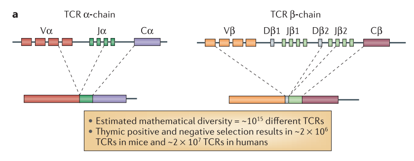

<a name="the-technology-of-immune-repertoires-sequencing"><h3>免疫组库测序技术 [<sup>目录</sup>](#content)</h3></a>

免疫组库测序技术开山第一篇：

> Profiling the T-cell receptor beta-chain repertoire by massively parallel sequencing. Genome Res. 2009 Oct;19(10):1817-24. doi: 10.1101/gr.092924.109. Epub 2009 Jun 18.

国内韩健的几乎同时发表的免疫组库技术文章：

> High throughput sequencing reveals a complex pattern of dynamic interrelationships among human T cell subsets. Proc Natl Acad Sci U S A. 2010 Jan 26;107(4):1518-23. doi: 10.1073/pnas.0913939107. Epub 2010 Jan 4.


<p align="center"></p>

免疫组库的多样性以及产生原因：

> There are approximately **10^10–10^11** B cells in a human
adult
>
> These cells are critical components of adaptive immunity, and directly bind to pathogens through BCRs expressed on the cell surface. Each B cell expresses a different BCR that allows it to recognize a particular set of molecular patterns. For example, some B cells will bind to epitopes expressed by influenza A viruses, and others to smallpox viruses
>
> Individual B cells gain this specificity during their development in the bone marrow, where they undergo **a somatic rearrangement process**: combines multiple germline-encoded gene segments to produce the BCR
>
> - the large number of possible V(D)J segments
> - additional (junctional) diversity
>
> lead to a theoretical diversity of **>10^14**
>
> further increased during adaptive immune responses,
when activated B cells undergo a process of s**omatic
hypermutation (SHM)**

研究人的免疫组库有几大难关（[韩健blog](http://blog.sina.com.cn/s/blog_52cb75b90100d2xm.html)）：

> （1）人的免疫细胞来源有限。外周血里十毫升血含有大约五百万B细胞，两千万个T细胞。考虑到免疫细胞的多样性，十毫升血里面可能每个独特的B或T细胞可能仅有几个。因此不扩增就没有办法研究。
>
> （2）一般的扩增办法不能同时多成千上万个靶点进行扩增，而且扩增会偏向与几个克隆而忽略其他。所以研究免疫组库的扩增方法需要覆盖面非常广，敏感性格外强。
>
> （3）扩增过程不能引入偏向性。不能有些CDR3得到更多的扩增。就是说扩增需要半定量。

总结上述难点，就是说研究免疫组库一定需要PCR扩增，扩增需要包容性（敏感性和特异性）而且需要半定量。除了arm-PCR以外，能够达到这些要求的扩增技术还没有听说过

arm-PCR引物的设计过程：

> <p align="center"></p>
>
> A 20 feet long table still not enough to hold the entire sequence alignment. Each row is an allele, and the entire locus is put together by scotch tape.
>
> Designing primers like this make one feels like a general facing a map planning battles.
>
> What we are doing is to align hundreds of sequences and design primers from the conserved regions from the same locus. Usually, design PCR require us to have detailed knowledge of biological function of the sequences. Computer software do not have that knowledge, and TM based primer design do not help, if at all.

B细胞高频突变对PCR引物设计的挑战：

> 在B细胞的发育过程中，有一个非常奇特的阶段：重组好的 VDJ 基因区（而且就在那个区）有高频率的突变，突变的结果是产生出与抗原结合效价更高的抗体。
>
> 在这个区域的突变率可以达到每个碱基有近10%的机会会发生突变。这就给设计PCR引物带来困难，因为引物的设计依据是没有发生突变以前的基因组序列，如果发生了突变，那引物很可能就会失效，尤其是引物的3'端，对突变就更敏感，如果3'端的最后三个碱基发生突变，那引物就会“翘”起来，导致扩增失败

<p align="center"></p>

<p align="center">免疫组库测序的技术流程 <sup><a href='#ref1'>[1]</a></sup></p>

Rep-seq studies involve large-scale sequencing of DNA libraries, which are prepared by amplifying the genomic DNA (gDNA) or mRNA coding for the BCR using PCR 

<p align="center"></p>

<p align="center">免疫组库测序的建库过程中采用的不同的PCR方法 <sup><a href='#ref1'>[1]</a></sup>。（a）多个引物–设计两个引物来互补V和J<br>片段内的区域。（b）5'RACE –仅设计一种引物来互补cDNA的恒定区。在第一轮扩增之后，<br>将均聚物合成地添加到3'中。再次用第一特异性引物和另一种靶向均聚物的引物扩增cDNA</p>


TCR与BCR的结构：

<table>
<tr>
	<td><p align="center"></p></td>
	<td><p align="center"></p></td>
</tr>
</table>

TCR与APC的互作：

<p align="center"></p>

<p align="center">(a)(b) TCR与APC的互作; (c)T细胞中的VDJ基因重排</p>

CDR3区域以及为什么选择CDR3区域作为靶向测序的区域：

> <p align="center"></p>
>
> TCR与BCR的可变区域的重组和生成方式相似，所以可以一并进行讨论，可变区域中有3个高频可变的子片段，包括CDR1、CDR2和CDR3
>
> 
>
> 其中CDR1与CDR2落在V基因片段，CDR3落在V-D-J的连接区域，包括V基因3'端（可能存在末端的缺失）、V-J基因间区的随机插入片段、D基因（两端都可能存在末端缺失）、D-J基因间区的随机插入片段、J基因的5'端（可能存在末端的缺失），结构示例图如下：
>
> 

整个V（D）J区的长度约为300个核苷酸

材料选择：用αβ还是γδ？

> TCR有 αβ（外周血中90%~95%）和 γδ（外周血中5%~10%）二聚体形式，一般对TCR的研究都是针对占主体的αβ二聚体形式，且α的CDR3区域是VJ junction，β的CDR3区域是VDJ junction，所以β链与α链相比具有更多的组合形式和连接的多样性，因此TCR-seq一般都是针对β链的CDR3区域

材料选择：用DNA还是RNA？

> DNA
> - 优点：丰富，容易提取且能保持长时间的稳定，且对于每一个TCR subunit，一个细胞只有两个位置有，或者说只有固定的两份拷贝，因此DNA模板分子的数量能反映T细胞的数量
> - 缺点：必须进行PCR扩增来达到足够的测序量，而为了得到进尽可能全的TCR库的组成，使用了多套PCR引物多重PCR方法，使得很容易在PCR过程中引入PCR bias
> 
> RNA
> 
> 使用5' RACE方法进行cDNA的扩增，因此只需要使用一套PCR引物即可
> - 优点：只使用一套PCR引物，极大地降低了PCR bias
> - 缺点：TCR表达水平的变异很大，不能准确地反映T细胞的数量

当我们尝试达到免疫库的最佳覆盖范围时，我们实际上旨在在整个库中对尽可能多的免疫球蛋白序列进行测序。也就是说，我们的目标是使生物体中已测序的免疫球蛋白（SI）与免疫球蛋白（TI）总数之间的比率最大化。我们的目标是使SI/TI比率达到1

较小的模型生物为达到该比例提供了更好的起点。较小的生物体包含的细胞总数明显减少，显然免疫细胞也较少。斑马鱼是研究适应性免疫系统的理想模型系统，其原因有两个：首先，它们具有可识别的最早的适应性免疫系统，其特征与人体必需元素相匹配；其次，斑马鱼免疫系统仅具有约30万种产生抗体的B细胞，使其比老鼠简单三个数量级，比人类简单五个数量级

详尽彻底的测序不是T细胞库分析的目标（也不现实，因为目前免疫组库基本都是从外周血取样，而要想实现彻底的测序，即意味着将这个个体外周血中的免疫细胞克隆型几乎全部取样到，除非将这个人的血几乎抽干，才可能实现），对于旨在阐明样本间差异的比较研究，极端深的TCR-seq也是没有必要的。对应TCR-seq来说，人们主要关心的是：**当取样不完整，测序深度差异比较大时，怎么鉴定一个给定的样本它的TCR组成与其他的样本不同？**

可以计算一个**置信度（confidence)**，来表示一个克隆在给定样本中差异于另一个样本是偶然产生的概率，概率越低则说明越不可能是由于偶然因素导致的，也就是说是真实的差异的可能性比较大

为了能够将两个或多个样本进行比较，需要先将它们的input data进行标准化处理：

> - 以多个样本中的数据量**最少的那个样本为基准**，对其他样本的reads进行无偏好的随机抽样，将它们的input data砍到同一水平 —— 这是在**生态学**研究中常用的方法
> 
> 这是目前免疫组库测序领域常用的标准化方法，但是该标准化方法是否合理？是否还有其他可选的方法？

比较样本间差异或相似度的几个指标：

- **Simpson diversity index**：样本间的多样性的比较
- **Morisita-Horn similarity index**：样本间相似度的比较

<a name="important-applications-of-repseq"><h3>RepSeq的几大重要应用 [<sup>目录</sup>](#content)</h3></a>

autoimmune diseases（目前主要针对多multiple sclerosis）:

>  - [J Neuroimmunol. 2009;213(1–2):123–30](https://www.ncbi.nlm.nih.gov/pubmed/19631394)
> - [J Autoimmun. 2010;35(4):325–35.](https://www.ncbi.nlm.nih.gov/pubmed/20727711)
> - [J Clin Invest. 2012;122(12):4533–43.](https://www.ncbi.nlm.nih.gov/pubmed/23160197)
> - [Ther Adv Neurol Disord. 2013;6(3):161–73.](https://www.ncbi.nlm.nih.gov/pubmed/23634189)
> - [Sci Transl Med. 2014;6(248):248ra107. ](https://www.ncbi.nlm.nih.gov/pubmed/25100741)
> - [Sci Transl Med. 2014;6(248):248ra106. ](https://www.ncbi.nlm.nih.gov/pubmed/25100740)

以下补充多发性硬化的知识：

> 中枢神经系统白质炎性脱髓鞘病变为主要特点的自身免疫病
>
> 多发性硬化患者不仅麻疹病毒抗体效价增高，其他多种病毒抗体效价也增高。感染的病毒可能与中枢神经系统（CNS）髓鞘蛋白或少突胶质细胞存在共同抗原，即病毒氨基酸序列与MBP等神经髓鞘组分的某段多肽氨基酸序列相同或极为相近，推测病毒感染后体内T细胞激活并生成病毒抗体，可与神经髓鞘多肽片段发生交叉反应，导致脱髓鞘病变

allergy :

> - [Wu Y-CB, James LK, Vander Heiden JA, Uduman M, Durham SR, Kleinstein SH, et al. Influence of seasonal exposure to grass pollen on local and peripheral blood IgE repertoires in patients with allergic rhinitis. J Allergy Clin Immunol. 2014;134(3):604–12.](https://www.ncbi.nlm.nih.gov/pubmed/25171866)
> - [Patil SU, Ogunniyi AO, Calatroni A, Tadigotla VR, Ruiter B, Ma A, et al. Peanut oral immunotherapy transiently expands circulating Ara h 2–specific B cells with a homologous repertoire in unrelated subjects. J Allergy Clin Immunol. 2015;136(1):125–34.](https://www.ncbi.nlm.nih.gov/pubmed/25985925)
> - [Hoh RA, Joshi SA, Liu Y, Wang C, Roskin KM, Lee J-Y, et al. Single B-cell deconvolution of peanut-specific antibody responses in allergic patients. J Allergy Clin Immunol. 2015.](https://www.ncbi.nlm.nih.gov/pubmed/26152318)

cancer :

> - [Lossos IS, Okada CY, Tibshirani R, Warnke R, Vose JM, Greiner TC, et al. Molecular analysis of immunoglobulin genes in diffuse large B-cell lymphomas. Blood. 2000;95(5):1797–803. ](https://www.ncbi.nlm.nih.gov/pubmed/10688840)
> - [ Glanville J, Kuo TC, Budingen H-C, Guey L, Berka J, Sundar PD, et al. Naive antibody gene-segment frequencies are heritable and unaltered by chronic lymphocyte ablation. Proc Natl Acad Sci U S A. 2011;108(50):20066–71.](https://www.ncbi.nlm.nih.gov/pubmed/22123975)
> - [ Kurtz DM, Green MR, Bratman SV, Scherer F, Liu CL, Kunder CA, et al. Non-invasive monitoring of diffuse large B-cell lymphoma by immunoglobulin high-throughput sequencing. Blood. 2015;125(24):3679–87.](https://www.ncbi.nlm.nih.gov/pubmed/25887775)

aging :

> - [Dunn-Walters DK, Banerjee M, Mehr R. Effects of age on antibody affinity maturation. Biochem Soc Trans. 2003;31(2):447–8.](https://www.ncbi.nlm.nih.gov/pubmed/12653658)
> - [ Dunn-Walters DK, Ademokun AA. B cell repertoire and ageing. Curr Opin Immunol. 2010;22(4):514–20.](https://www.ncbi.nlm.nih.gov/pubmed/20537880)
> - [Ademokun A, Wu Y-C, Martin V, Mitra R, Sack U, Baxendale H, et al. Vaccination-induced changes in human B-cell repertoire and pneumococcal IgM and IgA antibody at different ages. Aging Cell. 2011;10(6):922–30.](https://www.ncbi.nlm.nih.gov/pubmed/21726404)
> - [Martin V, Wu Y-CB, Kipling D, Dunn-Walters D. Ageing of the B-cell repertoire. Phil Trans R Soc B Biol Sci. 2015;370(1676).](https://www.ncbi.nlm.nih.gov/pubmed/26194751)

antibody discovery :

> - [Reddy ST, Ge X, Miklos AE, Hughes RA, Kang SH, Hoi KH, et al. Monoclonal antibodies isolated without screening by analyzing the variable-gene repertoire of plasma cells. Nat Biotechnol. 2010;28(9):965–9.](https://www.ncbi.nlm.nih.gov/pubmed/20802495)
> - [Cheung WC, Beausoleil SA, Zhang X, Sato S, Schieferl SM, Wieler JS, et al. A proteomics approach for the identification and cloning of monoclonal antibodies from serum. Nat Biotechnol. 2012;30(5):447–52.](https://www.ncbi.nlm.nih.gov/pubmed/22446692)
> - [Zhu J, Wu X, Zhang B, McKee K, O’Dell S, Soto C, et al. De novo identification of VRC01 class HIV-1 neutralizing antibodies by next-generation sequencing of B-cell transcripts. Proc Natl Acad Sci U S A. 2013;110(43):E4088–97.](https://www.ncbi.nlm.nih.gov/pubmed/24106303)
> - [Georgiou G, Ippolito GC, Beausang J, Busse CE, Wardemann H, Quake SR. The promise and challenge of high-throughput sequencing of the antibody repertoire. Nat Biotechnol. 2014;32(2):158–68.](https://www.ncbi.nlm.nih.gov/pubmed/24441474)

<a name="some-basic-problems"><h3>几个基础性的问题 [<sup>目录</sup>](#content)</h3></a>

（1）一个个体的免疫组库有多大？免疫组库的理论多样性有多高？

10^10–10^11 B cells in a human adult ([Ganusov VV, De Boer RJ. Do most lymphocytes in humans really reside in the gut? Trends Immunol. 2007;28(12):514–8.](https://www.ncbi.nlm.nih.gov/pubmed/17964854))

a theoretical diversity of > 10^14, which is further increased during adaptive immune responses, when activated B cells undergo a process of somatic hypermutation (SHM)

（2）免疫组库在不同的组织器官中的分布比例大概是多少？

it is estimated that only 2% of the 1–2 × 10^11 B cells in the human body are present in peripheral blood, compared with almost 28% in lymph nodes, 23% in the spleen and on mucosal surfaces, and 17% in the red bone marrow([Georgiou G, Ippolito GC, Beausang J et al. The promise and challenge of high-throughput sequencing of the antibody repertoire.Nat Biotechnol. 2014 Feb;32(2):158-68.](https://www.ncbi.nlm.nih.gov/pubmed/24441474))

（3）10ml外周血有多少免疫细胞？


<a name="standar-of-technology"><h3>技术标准 [<sup>目录</sup>](#content)</h3></a>

<a name="challenge-and-community"><h4>挑战与 AIRR 社区目标 [<sup>目录</sup>](#content)</h4></a>

New technology often spreads rapidly, sometimes more rapidly than the understanding of how to make the products of that technology reliable, reproducible, or usable by others. As complex technologies have developed, scientific communities have come together to adopt common standards, protocols, and policies for generating and sharing data sets, such as the MIAME protocols developed for microarray experiments. 

The Adaptive Immune Receptor Repertoire (AIRR) Community formed in 2015 to address similar issues for HTS data of immune repertoires.

AIRR社区官网：https://www.antibodysociety.org/the-airr-community/

芯片数据的标准化组织：MIAME（2001, DOI: 10.1038/ng1201-365）

NGS数据的标准化组织：DATA ACCESS （2015, DOI: 10.1126/science.aaa7485）

挑战：

> - the storage and transport of such large datasets
>
> - deposition into public archives is not uniformly required by journals or funding agencies
>
>    As of September 4, 2017, a Wiki page on the [B-T.CR forum](https://b-t.cr/) lists 82 AIRR-seq studies that report full HTS data to a public archive,2 while 42 (34%) do not
>
> -  the information required to ensure appropriate use of such data by secondary users requires delineation
>
> - the processing pipeline between the experiment and the ultimate analysis of the data is lengthy and specialized
>
>   - Yaari G, Kleinstein SH. **Practical guidelines for B-cell receptor repertoire sequencing analysis**. Genome Med. 2015 Nov 20; 7():121.
>   - Victor Greiff, Enkelejda Miho, Ulrike Menzel, Sai T.Reddy. **Bioinformatic and Statistical Analysis of Adaptive Immune Repertoires**. Trend in Immunology. 2015 Nov;36(11):738-749. doi: 10.1016/j.it.2015.09.006.
>
>   其他的流程与分析工具：https://b-t.cr/t/b-t-cr-wiki-home/321
>
> - the **annotation** required of AIRR-seq data is unique to these genes and subject to substantial uncertainty
>
>   - randomly chosen gene segments
>   - non-templated nucleotides added to the junctions
>   - nucleotides nibbled away from the gene segments
>
>   In B cells, somatic hypermutation during affinity maturation results in further diversification of immunoglobulin genes

AIRR Community的发展历史：

- 2015 established, at a meeting organized by Felix Breden, Jamie Scott, and Thomas Kepler in Vancouver, BC, USA to address these data sharing challenges.

    Membership includes:
    
    - researchers expert in the generation of AIRR data;
    - statisticians and bioinformaticians versed in their analysis;
    - informaticians and data security experts experienced in their management;
    -  basic scientists and physicians who turn to such data for critical insights;
    - experts in the ethical, legal, and policy implications of sharing AIRR data

    分成了3个小组，其对应任务：

    - **The Minimal Standards Working Group**: the development of a set of metadata standards for the publication and sharing of AIRR-seq datasets
    - **The Tools and Resources Working Group**: focused on the development of standardized resources to facilitate the comparison of AIRR-seq datasets and analysis tools, including collection, validation, and nomenclature of germline alleles
    - **The Common Repository Working Group**: establish requirements for repositories that will store AIRR data

<a name="standar-data-generation"><h4>Data Generation [<sup>目录</sup>](#content)</h4></a>

- standard operating procedures for cell isolation and purification, including panels and gating strategies for flow cytometry

- primers and protocols for amplification and sequencing of BCR or TCR rearrangements

- a clear description of library preparation and sequencing

<a name="standar-data-sharing"><h4>Data Sharing [<sup>目录</sup>](#content)</h4></a>

For transparency and reliable reuse, experiments need to be sufficiently well annotated to allow evaluation of the quality of individual datasets and comparability of different datasets

experimental metadata standards

区分两个概念：

> - data: consist of the raw sequences and the processed sequences
>
> - metadata: include
>
>    - clinical and demographic data on study subjects
>    
>    - protocols for cell phenotyping, nucleic acid purification, AIRR amplicon production, HTS library preparation and sequencing
>    
>    - documentation of the computational pipelines used to process the data


<a name="advice-for-study-design"><h2>实验设计的几点建议 [<sup>目录</sup>](#content)</h2></a>

<a name="advice-on-sampling"><h3>取样 [<sup>目录</sup>](#content)</h3></a>

<a name="the-source-of-TB-cells"><h4>从哪里取样 [<sup>目录</sup>](#content)</h4></a>

取样来源：

> Most human antibody sequencing studies have used B cells from **peripheral blood** because the blood is one of the few readily accessible sources of B cells in humans (tonsils is the other one). 
>
> However, it is estimated that only **2%** of the 1–2 × 10^11 B cells in the human body are present in peripheral blood, compared with almost 28% in lymph nodes, 23% in the spleen and on mucosal surfaces, and 17% in the red bone marrow
>
> Thus, **the antibody repertoire in peripheral B cells provides a narrow view of the humoral response to antigen challenge**
>
> <p align='right'>—— <a href='https://www.ncbi.nlm.nih.gov/pubmed/24441474'>Nat Biotechnol. 2014 Feb;32(2):158-68.</a></p>

可即使是这不充分取样的2%不到的淋巴细胞，对应目前的测序技术来说也是一个不小的挑战：

> 10毫升血里面可能有五百万B细胞，两千万T细胞，考虑到免疫细胞的多样性，这10毫升血里面可能每个特定的淋巴细胞仅有几个。所以扩增的方法需要敏感性极强（包容性好，最大限度地覆盖不同的免疫细胞），而且扩增过程和测序过程不破坏细胞间的比例（半定量），不是高表达的得到更多的扩增，而数目较少的克隆细胞就被掩盖了
>
> <p align='right'>—— <a href='http://blog.sina.com.cn/s/blog_52cb75b90100fstw.html'>韩健blog</a></p>

不充分的生物学取样的影响：

R.L. Warren, et al.
Exhaustive T-cell repertoire sequencing of human peripheral blood samples reveals signatures of antigen selection and a directly measured repertoire size of at least 1 million clonotypes
Genome Res., 21 (2011), pp. 790-797

> distinct 20 ml blood samples from the same individual captured only a portion of the TCR peripheral blood repertoire (biological undersampling)

足够高的测序深度能保证public clones的准确检测：

> technological undersampling has been shown to compromise the detection of ‘public’ clones (clones shared across individuals), which are a common target in immune repertoire studies
>
> In fact, several studies indicated that there was a positive correlation between sequencing depth and the number of public clones detected

两点建议：

> - the number of sequencing reads should at least exceed the clonal diversity of the sample if complete read coverage is unattainable
>
> - the lower the frequency of a clone, the higher the sequencing depth must be for its accurate capture

While knowing the exact clonal diversity of a lymphocyte population before HTS is not possible, basic knowledge of cell numbers and clonal frequency distributions, as well as **mathematical modeling**, facilitate the estimation of the required sequencing depth

For example, antigen-specific or clonally expanded populations (e.g., memory B and T cells, plasma cells) will have a clone-to-cell ratio that is well below 1, and thus less sequencing reads would be required to obtain a good snapshot of the clonal diversity

By contrast, clonal frequency distributions of naïve B and T cells have been shown to be more uniform (i.e., higher clone-to-cell ratios than clonally expanded populations)

<a name="what-kind-of-molecular"><h4>gDNA or mRNA [<sup>目录</sup>](#content)</h4></a>

Whether or not one should use gDNA or mRNA depends on what question is being asked

- gDNA

    优点：

    Sequencing gDNA facilitates estimation of the clonality of a given Ig sequence (in other words, the number of B cells expressing that antibody) because the number of sequence reads will, in general, be proportional to the number of gDNA template molecules (assuming no primer biases, as discussed below)

    缺点：

    - amplification of VDJ segments from gDNA necessitates the use of primer sets that anneal to all the individual germline V-gene segments

    - they contain productive and nonproductive VDJ rearrangements

    - the lower concentration of template in gDNA necessitates a greater number of PCR cycles; this increases error frequencies and further confounds quantification


- mRNA

    On the other hand, using mRNA as a template can provide an estimate of the relative expression level of various immunoglobulin sequences in the repertoire. 
    
    优点：

    enables amplification with reverse transcription and 5′RACE (5′ rapid amplification of cDNA ends) with 3′ primers that anneal to the constant region of IgH or IgL, thus circumventing the need for complex V-gene-specific primer sets

    缺点：

    However, because immunoglobulin transcription varies dramatically (up to 100-fold) between naive B cells and plasma cells, using unsorted bulk B cells from peripheral blood as the source of mRNA makes it challenging to deduce cellular clonal frequencies

<p align='right'>—— <a href='https://www.ncbi.nlm.nih.gov/pubmed/24441474'>Nat Biotechnol. 2014 Feb;32(2):158-68.</a></p>

<a name="advice-on-quality-control-for-dataset"><h3>数据质量：error correction [<sup>目录</sup>](#content)</h3></a>

Regardless of the sequencing platform, HTS has not yet reached the level of accuracy of Sanger sequencing because it suffers from errors introduced during **library amplification** (experimental) or **sequencing** (HTS, bridge amplification, platform-specific) 

PCR过程中产生的错误类型有：

> - differential amplification of some DNA templates over others (even in 5′RACE)
>
> - base misincorporation
>
>	Nucleotide misincorporation by PCR cannot generally be distinguished from most types of base-calling errors introduced during sequencing, but the latter generally occur at higher frequency and hence they are a greater concern
>
> - template switching
>
>	results in chimeras from the joining of fragments encoded by two or more template DNAs
>
>	Chimeras resulting from template switching generate sequences that either cannot be assigned to a germline V-gene segment by standard VDJ identification algorithms

Therefore, both experimental and computational strategies have been devised to attenuate the impact of errors on biological conclusions

a well-known statistical principle: **a given entity converges to its true (‘expected’) value (law of large numbers) if sampled sufficiently often**

UMI methods

> UMI methods in immune repertoire sequencing have been shown to achieve up to a 100-fold error reduction, thus considerably reducing artificial repertoire diversity
>
> However, a study by Shugay and colleagues indicated that increased RNA input (increasing from ng to μg) required a considerable increase in sequencing depth (10^6 to 10^7 sequencing reads) and a switch in sequencing platform (Illumina MiSeq to HiSeq) to ensure consensus read construction (presence of multiple sequencing reads with identical UMIs) 
>
> Therefore, to effectively use UMI approaches for error correction, technological oversampling is needed

Reliable clonal detection cutoffs

> While these cutoffs exploit the multiplicity of reads per clone as detection confidence, it has been indicated that hotspot PCR or sequencing errors are reproducible across technical replicates

其他的error correction方法：

> - The simplest
>
>   filtering HTS datasets (before any V(D)J annotation) for low-quality reads (e.g., Phred score) using
>
> - heuristic clonal abundance cutoffs
>
>   removal of clones with only 1–5 reads to decrease artificial diversity
>
> Warren and colleagues showed that abundance filtering is superior to strict quality filtering in decreasing artificial diversity
>
> Bolotin and colleagues demonstrated that aggressive quality filtering can even lead to loss of a significant portion of the data
>
> In fact, lower-quality reads may be recovered from **paired-end sequencing** (the inherently lower-quality 3′ ends of sequencing reads gain in confidence via an overlapping region in both forward and reverse reads) or by **merging lower-quality reads with reads of higher quality and identical** or **very similar clonal identifiers**

<a name="advice-on-data-analysis"><h3>数据分析 [<sup>目录</sup>](#content)</h3></a>

[Genome Med. 2015 Nov 20;7:121.](https://www.ncbi.nlm.nih.gov/pubmed/26589402)

<p align='center'></p>

For bioinformaticians and others used to dealing with different types of HTS experimental data (such as DNA-seq and RNA-seq data), approaching Rep-seq data requires a change of mindset

> - BCR sequences are not encoded directly in the genome
>
>    While parts of the BCR can be traced back to segments encoded in the germline (that is, the V, D and J segments), the set of segments used by each receptor is something that needs to be inferred, as it is coded in a highly repetitive region of the genome and currently cannot be sequenced directly
>
> - these segments can be significantly modified during the rearrangement process and through SHM, whichleads to >5 % of bases being mutated in many B-cell subsets
>
> - there are no pre-existing full-length templates to align the sequencing reads

<a name="advice-on-data-analysis-pre-processing"><h4>Pre-processing [<sup>目录</sup>](#content)</h4></a>

goal: transform the raw reads that are produced by HTS into error-corrected BCR sequences

需要考虑的影响因素：

> - sequencing depth
>
> - read length
>
> - paired-end versus single-end reads
>
> - inclusion of unique molecular identifiers (UMIs; sometimes referred to as UIDs)

if the data are very large (several million reads per sample are common), it is advisable to sample a random subset (say 10,000 reads) and carry out the steps below to make sure quality is reasonable and the read conforms to the experimental design

It is useful to keep track of how many sequences pass each step successfully so that outliers can be detected. The outliers may reflect steps for which the parameters need further tuning or may indicate issues related to the experiments

可以讲数据预处理操作分成以下三部分

- **Quality control and read annotation**

    If samples are multiplexed, the sequencing facility will normally de-multiplex the data into one FASTQ file for each sample

    If the data are pairedend, each sample will produce two FASTQ files (one for each read-end)

    - de-multiplex
    
        If the data have not been de-multiplexed by the sequencing facility, the first step in the analysis is to identify the sample identification tags to as multiplex identifiers (MIDs) or sample identifiers (SIDs)) to determine which reads belong to which samples

        These MID tags typically consist of a short number of base pairs (commonly 6–16) that are located near the end(s) of the amplicon

        If multiple MIDs are designed to be in each sequence(named UMI), these should be checked for consistency in order to reduce the probability of misclassification of reads due to PCR and sequencing errors

    -  handling low-quality reads and bases

        It is desirable to have a Phred-like score >30 for a long stretch at the beginning of each read. Quality will typically drop near the end of each read

        If the library is designed to have a lot of overlap in the paired reads, then low-quality positions at the ends of the reads can be cut at this stage to allow better assembly of the paired reads

        The appropriate quality thresholds to employ are dataset dependent, and insight may be gained by plotting the distribution of quality scores as a function of position in the sequence

    - identify, annotate, and mask the primers

        The location of the primer sequences depends on the library preparation protocol

        A typical setup includes a collection of V segment primers at the 5′ end and a set of J (or constant region) primers at the 3′ end of the amplicon

        In library preparation protocols in which 5′ rapid amplification of cDNA ends (5′ RACE) is used, there will not be a V segment primer

        In this step, it is crucial to know where on the read (and on which read of a pair) each primer is located

        注意一种特殊情况：primer设在恒定区域

        > each constant region primer may be associated with a specific isotype (immunoglobulin (Ig)M, IgG, and so on)
        >
        > The part of the sequence that matches the primer should then be cut or masked (bases changed to N)
        >
        > This is because the region bound by the primer may not accurately reflect the state of the mRNA/DNA molecule being amplified. For example, a primer designed to match a germline V segment sequence may bind to sequences with somatic mutations, thus leading to inaccuracy in mutation identification in downstream analysis

- **Unique molecular identifiers**

    UMIs are highly diverse nucleotide tags appended to the mRNA, usually at the reverse transcription step. UMIs are usually located at a specific position(s) in a read (for example, a 12 base pair (bp) UMI at one end of the read or split as two 6 bp identifiers at opposite ends of the amplicon). The length of the UMI depends on protocol, but is typically around 15 bases. The random nature of the UMI enables each sequence to be associated with a single mRNA molecule. They are designed to reduce PCR amplification biases and sequencing error rates through the generation of consensus sequences from all amplicons with the same UMI

    步骤：

    > -  identified in each read, and then it is removed from the read and the read is annotated with the UMI sequence
    >
    > - checked that the UMIs conform to the experimental protocol by plotting the distribution of bases at each position in the UMI and the distribution of reads per UMI to make sure that there are no unexpected biases
    >
    > - sequences with “similar” UMIs should be clustered together
    >
    >   Clustering approaches can be used for recognizing UMIs that are expected to correspond to the same pre-amplified mRNA molecule (for example, single linkage hierarchical clustering)
    >
    >   However, it is possible that each of these UMI clusters corresponds to multiple mRNA molecules. This may be due to incorrect merging, insufficient UMI diversity (that is, UMI sequences that are too short, or bad quality such as GC content biases), or bad luck
    >
    > - build a consensus sequence from each cluster of reads

    可用的工具：MiGEC 和 pRESTO

- **Assembly of paired-end reads**

    In most cases, experiments using paired-end sequencing are designed so that the two reads are expected to overlap each other

    Assembly of the two reads into a single BCR sequence can be done de novo by scoring different possible overlaps and choosing the most significant. Discarding reads that fail to assemble may bias the data towards shorter BCR sequences, which will have a longer overlapping region

    **Alignment-aided overlaps** : When the overlap region is expected to be in the V segment, it is also possible to determine the relative positions of the reads by aligning them to the same germline V segment. This is especially useful when not all read pairs are expected to overlap, and Ns can be added between the reads to indicate positions that have not been sequenced

    > 上面这一段可能有些难以理解，下面附上来自MiXCR工具的 [document](https://mixcr.readthedocs.io/en/latest/align.html#paired-end-reads-overlap) 中的信息，以帮助理解：
    >
    > If two reads were aligned against the same V gene (which is the most common case; while the same algorithm is applied to J alignments), and MiXCR detects that the same nucleotides (positions in the reference sequence) were aligned in both mates - this is a strong evidence that paired-end reads actually overlap. In this case MiXCR merges them into a single sequence using this new information

    Since each read of a pair may be associated with different annotations (for example, which primers were identified), it is critical to merge these annotations so that they are all associated with the single assembled read, such as the base quality in the overlap region can be recomputed and propagated

    it is also useful to identify sequences that are identical at the nucleotide level, referred to as “duplicate” sequences, and group them to create a set of “unique” sequences —— 这部操作存在一个问题：扩增的克隆可能带来“duplicate” sequences，此时如果以PCR重复来过滤就可能丢掉了克隆扩增的信息，不过这种操作在mRNA文库有益，而对DNA文库不合适

<a name="advice-on-data-analysis-VDJ-germline-segment-assignment"><h4>V(D)J germline segment assignment [<sup>目录</sup>](#content)</h4></a>

In order to identify somatic mutations, it is necessary to infer the germline (pre-mutation) state for each observed sequence. This involves identifying the V(D)J segments that were rearranged to generate the BCR and determining the boundaries between each segment

Most commonly this is done by applying an algorithm to choose among a set of potential germline segments from a database of known segment alleles

那怎样从中选出合适的基因片段呢？

Since the observed BCR sequences may be mutated, the identification is valid only **in a statistical sense**

As such, multiple potential germline segment combinations may be equally likely. In these cases, many tools for V(D)J assignment report multiple possible segments for each BCR sequence

**In practice, it is common to use one of the matching segments and ignore the rest**

但是这么做会引入误差：

> This has the potential to introduce artificial mutations at positions where the possible segments differ from each other

可采取的缓解措施：

> Genotyping and clonal grouping, which are described below, can help reduce the number of sequences that have multiple segment assignments

The performance of V(D)J assignment methods crucially depends on the set of germline V(D)J segments. If the segment allele used by a BCR does not appear in the database, then the polymorphic position(s) will be identified as somatic mutation(s)

<p align="center"></p>

Statistical analyses rely predominantly on clonotyped data and are therefore preceded by a workflow composed of raw data preprocessing (read filtering, error correction), germline annotation, and clonotyping

Sequence-dependent approaches:

> - visualize convergence of repertoires by quantifying clonal overlap [Venn diagrams; overlap indices such as Morisita–Horn]
>
> - display the clonal architecture of repertoires (networks)
>
>	highlighting denser (clonal expansion) or sparser regions of the repertoire
>
>	each vertex is a clone, the size of each vertex is proportional to its abundance, red color highlights selected clones
>
> -  reveal dynamics of clones (Circos graphs) shared across samples (sections) by visualizing their change in frequency (bars)
>
> - retrace clonal evolution (phylogenetic trees) helping for instance the visualization of the phylogenetic relation of different clonal lineages (color-coded)

选择合适的clontype的定义及其对数据解读的影响：

> While the definition of clonality in a biological sense is widely accepted (all lymphocytes having the same BCR or TCR belong to the same clone, see above), its translation to HTS data is challenging owing to the influence of PCR and sequencing errors, and of SHM
>
> 可以选择的合适的序列同源性来聚类相似克隆
>
> clustering by CDR3 homology at the nucleotide level has been performed in the following ways: 
>
> - inferring unmutated common ancestors
>
> - absolute edit distance cutoffs in hierarchical clustering linkage trees, allowing a range of mismatches (one, three, or five) in sequences within one clonotype
>
> - clustering by using relative thresholds (90%, 95%, 97.25%, 100%)
>
> Clonotyping reduces the influence of PCR and sequencing errors on clonal diversity estimations but also, in the case of B cells, serves to group clones that belong to the same clonal lineage
>
> A robust clonotype definition is, therefore, a defining step in every immune repertoire HTS study because it has a large impact on biological conclusions drawn (especially in diversity analyses
>
> Tipton et al. recently defined clonotypes by experimental validation as sequences with CDR3 (hamming) nucleotide identity of >85% using replicate sequencing

常用的免疫组库数据注释（或VDJ mapping）工具及其功能和优缺点比较：

|	` `	|	IMGT/High-V-Quest	|	IgBlast	|	iHMMune-align	|	MIGEC	|	MIXCR	|
|:---|:---|:---|:---|:---|:---|
|	Analysis of TCR and BCR data	|	TCR and BCR	|	BCR	|	BCR	|	TCR and BCR	|	TCR and BCR	|
|	Prediction of germline sequences	|	Yes	|	Yes	|	Yes	|	No	|	Yes	|
|	Extraction of FR/CDR/constant region (CR)	|	FR, CDR	|	For V region only (until V-part of CDR3)	|	No	|	CDR3	|	FR/CDR/CR	|
|	SHM extraction	|	Yes (but V region only)	|	Yes (entire V(D)J region)	|	Yes (entire V(D)J region)	|	No	|	Yes (entire V(D)J region)	|
|	Reference numbering scheme	|	IMGT	|	IMGT/Kabat/NCBI	|	UNSWIg	|	IMGT	|	IMGT	|
|	Max number of sequences per analysis	|	≤500 000	|	∼1000 (online) Unrestricted (standalone)	|	∼2 Mb (Online), Unrestricted (standalone)	|	Unrestricted	|	Unrestricted	|
|	Processing of unique molecular identifiers	|	No	|	No	|	No	|	Yes	|	No	|
|	Consideration of sequencing quality information (Phred scores)	|	No	|	No	|	No	|	Yes	|	Yes	|
|	Speed (standard dataset of 1 × 106 reads)	|	Days	|	Hours	|	Hours	|	Minutes	|	Minutes	|
|	Supported input format	|	FASTA	|	FASTA	|	FASTA	|	FASTQ	|	FASTA, FASTQ	|
|	Platform	|	Online	|	Online/stand-alone	|	Online/stand-alone	|	Stand-alone	|	Stand-alone	|

<a name="common-used-toolkits"><h2>现有通用工具集 [<sup>目录</sup>](#content)</h2></a>

<table>
<tr>
    <td></td>
    <td><strong>pRESTO</strong><br>- Quality control<br>- Read assembly<br>- UMI processing<br></td>
</tr>
<tr>
    <td></td>
    <td><strong>Change-O</strong><br>- V(D)J reference alignment standardization<br>- Clonal clustering<br>- Germline reconstruction<br>-Conversion and annotation </td>
</tr>
</table>

<a name="common-used-toolkits-pRESTO"><h3>pRESTO [<sup>目录</sup>](#content)</h3></a>

composed of a suite of utilities to handle all stages of sequence processing prior to germline segment assignment

pRESTO is designed to handle either single reads or paired-end reads. It includes features for 

- quality control
- primer masking
- annotation of reads with sequence embedded barcodes
- generation of unique molecular identifier (UMI) consensus sequences
- assembly of paired-end reads and identification of duplicate sequences

Numerous options for sequence sorting, sampling and conversion operations are also included.

<p align='center'></p>

The workflow is divided into four high-level tasks:

> - Paired-end assembly
>
>   Depending on the amplicon length in your data, not all mate-pairs may overlap. For the sake of simplicity, we have excluded a demonstration of assembly in such cases. pRESTO provides a couple approaches to deal with such reads. 
>
>   The reference subcommand of `AssemblePairs` can use the ungapped V-segment reference sequences to properly space non-overlapping reads. Or, if all else fails, the `join` subcommand can be used to simply stick mate-pairs together end-to-end with some intervening gap.
>
> - Quality control and primer annotation
>
>    - Removal of low quality reads, use subcommand  `FilterSeq`
>    - Read annotation and masking of primer regions
>
>       primer mask的必要性：
>
>        When dealing with Ig sequences, it is important to cut or mask the primers, as B cell receptors are subject to somatic hypermutation (the accumulation of point mutations in the DNA) and degenerate primer matches can look like mutations in downstream applications
>
>       注意：对于双端reads与由原始PE合并后的一条长reads，它们的primer mask/cut的操作时不同的，而且它们的两端的称号也不同，PE：Forward-end与Reverse-end，Assembled：head与tail：
>
>        ```
>        PE read:
>        |------------------------->
>        >>>>>
>                                        <<<<
>                <==========================|
>
>        Assembled long read:
>        |------------------------->====================|
>        >>>>>                                     <<<<<
>        ```
>
>       对于Assembled long read，其head端的primer mask/cut的操作正常，而对于tail端的，它时其原始reads的反向互补序列，此时要么将tail端反向互补回来再与Reverse-end的primer进行比较，要么将Reverse-end的primer进行反向互补回来再与tail端比较，pRESTO就采用了两步操作来完成Assembled long read的head与tail端primer mask/cut
>
>        ```bash
>        MaskPrimers.py score -s M1_quality-pass.fastq -p Greiff2014_VPrimers.fasta \
>            --start 4 --mode mask --pf VPRIMER --outname M1-FWD --log MPV.log
>        MaskPrimers.py score -s M1-FWD_primers-pass.fastq -p Greiff2014_CPrimers.fasta \
>            --start 4 --mode cut --revpr --pf CPRIMER --outname M1-REV --log MPC.log
>        ```
>
> - Deduplication and filtering
>
>   - Identify duplicate sequences
>
>       First, the set of unique sequences is identified using the CollapseSeq tool, allowing for up to 20 interior N-valued positions (-n 20 and --inner), and requiring that all reads considered duplicates share the same C-region primer annotation (--uf CPRIMER). Additionally, the V-segment primer annotations of the set of duplicate reads are propagated into the annotation of each retained unique sequence (--cf VPRIMER and --act set)
>
>   - Filtering to repeated sequences
>
>   - Creating an annotation table
>
>       Finally, the annotations, including duplicate read count (`DUPCOUNT`), isotype (`CPRIMER`) and V-segment primer (`VPRIMER`), of the final repertoire are then extracted from the SplitSeq output into a tab-delimited file using the table subcommand of `ParseHeaders`

<a name="common-used-toolkits-ChangeO"><h3>Change-O [<sup>目录</sup>](#content)</h3></a>


<a name="QC-for-RepSeq-data"><h2>基本数据质控 [<sup>目录</sup>](#content)</h2></a>

<a name="structure-identification-of-cdr3-region"><h3>CDR3区域结构鉴定 [<sup>目录</sup>](#content)</h3></a>


CDR3结构鉴定（VDJ mapping）是免疫组库数据分析中的关键性的也是基础性的一步：

> A fundamental step in the analysis of such a sequencing data set is to reconstruct the origin of each nucleotide in each sequence: whether it came from an N-addition or from a germline V, D, or J gene, and if so, which one and where

VDJ mapping存在的困难和挑战：

> - 片段连接末端的随机丢失的存在：
>
>   Even if a complete collection of alleles (gene variants between individuals) for the germline V, D, and J genes were available, this problem would be challenging because **exonuclease deletion** obscures the boundaries between N-regions and germline V, D, and J gene sequences
>
> - BCR的结构鉴定更困难：体细胞高频突变（somatic hypermutation）的存在
>
>   若邻接N-region的片段无法找到完全匹配的germline V，D，J片段，则它有困难是germline V，D，J片段发生了点突变，也有可能是N-addtion

这本质上可以看做是序列中碱基来源的注释问题（“annotation problem”）

目前采用的解决方法有：

> - 基于BLAST的序列搜索和Smith-Waterman的局部序列比对
>
>   代表工具：NCBI-IgBLAST、IMGT的在线工具
>
>   缺点：对BCR的SHM引入的不确定性，区分度较差
>
> - 基于HMM
>
>   代表工具：SoDA
>
>   隐含状态： (gene, nucleotide position) pairs 或 N-region nucleotides
>
>   发射状态：碱基 或 氨基酸残基
>
>   对于BCR的分析场景，发射概率中包含突变的概率

<a name="Gene-features-and-anchor-points"><h4>Gene features and anchor points [<sup>目录</sup>](#content)</h4></a>

There are several immunologically important parts of TCR/BCR gene (gene features). For example, such regions are three complementarity determining regions (`CDR1`, `CDR2` and `CDR3`), four framework regions (`FR1`, `FR2`, `FR3` and `FR4`) etc

- **Germline features**

    **V Gene structure**

    <p align='center'></p>

    Additionally to core gene features in V region (like `FR3`) we introduce `VGene`, `VTranscript` and `VRegion` for convenience

    **D Gene structure**

    <p align='center'></p>

    J Gene structure

    <p align='center'></p>

- **Mature TCR/BCR gene features**

    Important difference between rearranged TCR/BCR sequence and germline sequence of its segments lies in the fact that during V(D)J recombination exact cleavage positions at the end of V gene, begin and end of D gene and begin of J gene varies

    As a result in most cases actual `VEnd`, `DBegin`, `DEnd` and `JBegin` anchor positions are not covered by alignment:

    <p align='center'></p>

    In order to use actual V, D, J gene boundaries we introduce four additional anchor positions: `VEndTrimmed`, `DBeginTrimmed`, `DEndTrimmed` and `JBeginTrimmed` and several named gene features: `VDJunction`, `DJJunction` and `VJJunction`

    On the following picture one can see the structure of V(D)J junction:

    <p align='center'></p>

    If D gene is not found in the sequence or is not present in target locus (e.g. TRA), `DBeginTrimmed` and `DEndTrimmed` anchor points as well as `VDJunction` and `DJJunction` gene features are not defined

- **Gene feature syntax**

    Syntax for gene features is the same everywhere. The best way to explain it is by example:

    - to enter any gene feature mentioned above or listed in the next section just use its name: `VTranscript`, `CDR2`, `V5UTR` etc

    - to define a gene feature consisting of several concatenated features use `+`: `V5UTR+L1+L2+VRegion` is equivalent to `VTranscript`

    - to create gene feature starting at anchor point `X` and ending at anchor point `Y` use `{X:Y}` syntax: `{CDR3Begin:CDR3End}` for `CDR3`

    - one can add or subtract offset from original position of anchor point using positive or negative integer value in brackets after anchor point name `AnchorPoint(offset)`: `{CDR3Begin(+3):CDR3End}` for CDR3 without first three nucleotides (coding conserved cysteine), `{CDR3Begin(-6):CDR3End(+6)}` for CDR3 with 6 nucleotides downstream its left bound and 6 nucleotides upstream its right bound

    - one can specify offsets for predefined gene feature boundaries using GeneFeatureName(leftOffset, rightOffset) syntax: `CDR3(3,0)`, `CDR3(-6,6)` - equivalents of two examples from previous item

    - all syntax constructs can be combined: `{L1Begin(-12):L1End}+L2+VRegion(0,+10)}`

<a name="standar-methods-for-structure-identification"><h4>标准结构鉴定方法 [<sup>目录</sup>](#content)</h4></a>

基本上就是基于与germline的V、D、J基因片段进行比对来鉴定，比对方法有基于Smith-Waterman算法的，有基于seed-and-vote方法的，也有基于BLAST的

与V和J基因相反，由于序列长度短，D段的鉴定更为复杂

鉴定出的CDR3区域的解构如下图：


<a name="error-in-struture-identification-and-methods-to-overcome"><h4>标准结构鉴定方法存在的问题及解决策略 [<sup>目录</sup>](#content)</h4></a>

由于在原始的重组过程中发生了三次随机事件：

> - V、D、J基因片段的随机选择；
>
> - 在V基因片段的末端，D基因的两端以及J基因的起始端的随机删除；
>
> - 在VD与DJ重组片段之间的非模板依赖性的随机插入；

这使得按照标准的结构鉴定方法鉴定出的结果会存在系统偏差：

> 某一个检测到的CDR3序列，可能由多种重组方式得到，而基于序列比对方法的结构鉴定倾向于选择尽可能长匹配 germline 基因片段，来作为最优重组来源的片段，但是最长的匹配并不意味着一定是最可能的重组方式

最好的方式是将所有可能的潜在重组形式列出来，然后计算出每种重组形式的似然，而似然的计算可以基于从测序数据中学习得到的概率模型算出 <sup><a href='#ref2'>[2]</a></sup>


<a name="index-for-characterize-individual-immune-repertoire"><h3>一些描述样本免疫组库的指标 [<sup>目录</sup>](#content)</h3></a>

- **个体免疫多样性** (immunological diversity)

	采用信息论中的香农指数

	$$H=-\sum_i^{|S|}p(c_i)\log p(c_i)$$

	其中，$S$表示该样本total unique clone的集合$S=\{c_1,c_2,...,c_m\}$

- **个体免疫组库采样的饱和度**

	采用了生态学中常用的 Chao1 指数 <sup><a href='#ref3'>[3]</a></sup>，它常被用作种群丰富度的一个描述指标

	想象一下这样一个场景：

	> 在一个放了各种各样玩具模型的水池中（水池很大，其中玩具有相同的，有不同的，且各种类型及数目不限），随机来捞玩具。这时捞起来一个，发现之前有个玩具和这个捞起的玩具一模一样，这时有两个这种玩具在手上，这个玩具模型就是**doubletons**；当然也可能捞起一个玩具发现手里没有相同的，那这个就叫**singletons**

	那么经典的chao1指数的计算公式是这样的：

	$$S_{chao1}=S_{obs}+\frac{F_1^2}{2F_2}$$

	$S_{obs}$表示样本中观察到的物种数目。$F_1$和$F_2$分别表示singletons和doubletons的数目

	由经典公式可以看到，当doubletons为0（即$F_2$为0）时计算的结果没有意义，因此又提出了另外一种修正偏差的公式

	$$\hat S_{chao1}=S_{obs}+\frac{F_1(F_1-1)}{2(F_2+1)}$$

	可以这样理解这个修正公式（虽然不太严格）：它从singletons中拿出1条来（严格来说与经典公式相比还不到1条），当作doubletons，这样分母一定会大于0

	理解chao1指数的含义：

	> chao1指数是用来反映物种丰富度的指标
	>
	> 它通过观测到的结果推算出一个理论的丰富度，这个丰富度更接近真实的丰富度——一般来讲能观测到的物种丰富度肯定会比实际少，那么两者之间的差距有多大呢？
	>
	> chao1指数给出的答案是 $(F_1^2)/(2F_2)$，它通过singletons和doubletons进行了合理的推算，那么差距为 $(F_1^2)/(2F_2)$ 的合理性在哪里？
	>
	> 分析 $(F_1^2)/(2*F_2)$ 我们不难发现它对singletons的权重要高于doubletons (即 $F_1^2$ 比 $2F_2$ 变化的速度更快)，这和我们的一个直观理解是相符的：
	>
	> 在一个群体中随机抽样，当稀有的物种 (singletons) 依然不断的被发现时，则表明还有一些稀有的物种没有被发现；直到所有物种至少被抽到两次 (doubletons) 时，则表明不会再有新的物种被发现

	可以通过比较chao1指数和实际检测到的unique克隆数进行比较，来评估当前样本的测序饱和度

<a name="pcr-and-sequencing-error-correction"><h3>PCR与测序错误的校正 [<sup>目录</sup>](#content)</h3></a>

Nguyen P  <sup><a href='#ref10'>[10]</a></sup> 等试图直接评估这些错误率，并提出了通过分析这些错误并实施质量过滤器来减少库中错误序列数量的新方法。为此，他们分析了从RAG缺陷型(Rag-/-)小鼠中获得的特定转基因TCR，使它们能够表达单个种系重排的TCR，因此可以将测序的受体与原始DNA进行比较。他们的研究表明，错误序列的总发生率为1–6％，在过滤过程之后，这些错误被大大减少了，但并没有完全减少

测序错误的影响及处理方法：

> TCR-seq对测序错误十分敏感，因为只要有一个碱基不同，一条TCR β链就能区别于其他的克隆，一个碱基的测序错误可能在后续的分析中会被错误地鉴定出一个低丰度的新克隆，因此
> 
> **（1）** 在进入后续分析之前需要执行严格的质控，但是 **（2）** 对于深度的TCR-seq则没有这个必要，因为错误的TCR序列总是表现出低丰度的特征，因此通过一个丰度的阈值筛选就可以比较轻松且准确地将这些错误的TCR克隆过滤掉；还有另外一种解决方法 **（3）** 假设每一种低丰度的克隆都是由测序错误产生的，将它们分别与高丰度的克隆依据序列相似性进行聚类，将高丰度的克隆的序列作为它的正确的序列

- 基于计算方法的校正

（1）Wei Zhang等提出了一种进行错误校正的方法 <sup><a href='#ref4'>[4]</a></sup>

可分为三步进行，前两步进行测序错误的校正，最后一步进行PCR错误校正：

> （1）将reads根据测序质量分成三组：
>
> 	> - 高质量序列：每个碱基的质量都大于Q20；
> 	> - 丢弃序列：超过5个碱基的质量低于Q20，将这样的reads直接丢弃；
> 	> - 低质量序列：减去前两组，剩下的那些序列；
>
> （2）将低质量的序列比对到高质量的序列上，若某条低质量序列能比对到这样一条高质量序列：mismatch数不超过5个碱基，且都落在低质量位点上，则依据高质量序列对mismatch位点进行修正，否则丢弃这条低质量序列；
>
> （3）最后，为了消除PCR过程中引入的错误，将低丰度的reads比对高丰度reads，对于某一个低丰度reads，若能找到一条高丰度reads使得它们之间的mismatch低于3个碱基，则将它合并到对应高丰度reads中；

（2）Bolotin D等开发的MiXCR的错误矫正方法也同时考虑了PCR错误与测序错误 <sup><a href='#ref5'>[5]</a></sup>：


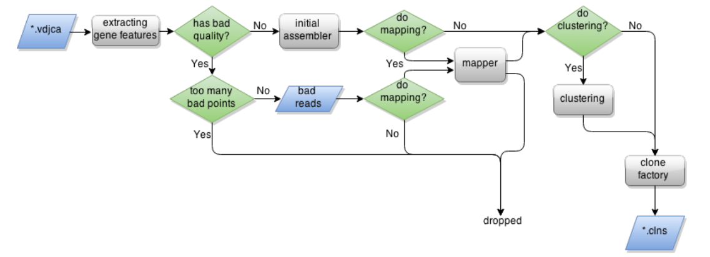

简单来说：

校正测序错误的方法与上面的相同：用高质量的序列来校正低质量序列的低质量碱基

校正PCR error依据这样一个假设：

> PCR错误一般出现在PCR的比较靠后的阶段，如果共进行了N轮PCR，对于某一条template read，在这N轮PCR过程中总共发生了n次PCR错误（假设每次PCR错误只发生一个碱基错误且每轮最多只发生一次），PCR错误既可能发生在原始的template read上，也可能发生在已经发生PCR错误的read上，我们可以用一个树形结构来记录这条template read的PCR错误的发生进程（称为变异发生树）
>
> 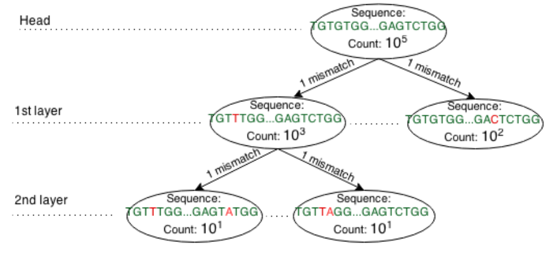
>
> 越靠近叶节点则错误发生得越晚，则这次错误得到的衍生序列的拷贝数就会越少

基于这样的现象，如果我们能基于测序的reads构建出一系列这样的变异发生树，则我们就可以得到进行PCR扩增之前的原始read以及其真实的丰度（原始read以及各种变异衍生reads丰度的累计丰度）

- 基于实验技术的方法 <sup><a href='#ref6'>[6]</a></sup>


<a name="multiplex-pcr-bias-minimization"><h3>缩小多重PCR引入的PCR bias [<sup>目录</sup>](#content)</h3></a>

一般PCR仅应用一对引物，通过PCR扩增产生一个核酸片段，而多重PCR (multiplex PCR)，又称多重引物PCR或复合PCR，它是在同一PCR反应体系里加上二对以上引物，同时扩增出多个核酸片段的PCR反应，其反应原理，反应试剂和操作过程与一般PCR相同·

在免疫组库建库的过程中一般都采用针对V和J基因的多套引物进行PCR扩增，即使用的是多重PCR方法，与普通PCT相比，多重PCR明显会带来更大程度的PCR bias，所以为了保证下游分析的可靠性，进行PCR bias的修正是非常有必要的

Wei Zhang等提出了一种进行PCR bias修正的方法 <sup><a href='#ref4'>[4]</a></sup>：

该方法基于这样一个前提假设：multiplex PCR过程中，克隆的扩增效率仅受到以下两个因素的影响——**模板的浓度**和**多重引物的效率**

基于上面的假设，研究人员做了以下实验来探究这些因素之间的关系：

按照下表列出来的引物对应克隆配比，将33套PCR引物（足量）加入到3对样本中

|	Plasmid No.	|	V gene	|	J gene	|	Plasmidmix 1-1*	|	Plasmidmix 1-2*	|	Plasmidmix 2-1*	|	Plasmidmix 2-2*	|	Plasmidmix 3-1*	|	Plasmidmix 3-2*	|
|:---:|:---:|:---:|:---:|:---:|:---:|:---:|:---:|:---:|
|	C-01	|	TRBV10-1	|	TRBJ2-7	|	2000	|	2000	|	10	|	10	|	100000	|	100000	|
|	C-02	|	TRBV10-2/3	|	TRBJ2-7	|	2000	|	2000	|	1000	|	1000	|	1000	|	1000	|
|	C-03	|	TRBV11-1/2/3	|	TRBJ1-3	|	2000	|	2000	|	10	|	10	|	100000	|	100000	|
|	……	|	……	|	……	|	……	|	……	|	……	|	……	|	……	|	……	|
|	C-33	|	TRBV9	|	TRBJ1-2	|	2000	|	2000	|	100	|	100	|	10000	|	10000	|

注：$\text{Plasmidmix}_{i-j} , (i\in \{1,2,3\},j\in\{1,2\})$表示第i个样本对中的第j个样本

可以看出同一个样本对中的两个样本，它们的每一对引物对应克隆的浓度配比都是一样的，因此，每一个克隆有三种不同的浓度

它的校正思路为：

> （1）先进行克隆浓度的校正。先排除引物效率的影响，即选定某一种克隆（则与它对应的PCR引物也唯一确定了，也就排除了不同引物的效率的影响了），使用不同的克隆浓度，分析克隆浓度对PCR bias（表现为不同浓度导致扩增后observed frequency的不同）的影响，构建回归模型来定量描述克隆浓度与PCR bias的关系；
>
> （2）进行引物效率的校正。先排除克隆浓度的影响，即选择克隆浓度相同的那些克隆放在一起分析，这些克隆浓度相同，但是所对应的PCR引物不同，则在前面的前提假设下，导致PCR bias（表现为不同PCR引物导致扩增后observed frequency的不同）的因素只有引物的效率，因可以据此分析引物效率队PCR bias的影响

- **先进行浓度的校正**

	为了控制潜在变量的影响，将相同浓度的克隆合并到一个相同的组进行研究，因此可以聚成5个浓度的组（总共有5种可选浓度，则理论上总共有$\left( \begin{matrix} 5 \\ 3 \end{matrix}\right)=10$种可能，但是实际上只用到了里面的5种）：10_2E4_1E5、1000_2E4、100_1000_2E4、100_1E4_2E4 和 10_1E4_2E4 （可以看出是$i\_j\_k(i<j<k)$形式，它是某个克隆的3个浓度）

	以10_2E4_1E5组为例，说明依据浓度进行的方法：

	先计算在这组中浓度期望分别为10、2E4和1E5的克隆实际浓度的均值

	$$\mu(j)=\frac 1n \sum_{i=1}^nf(i,j) \quad j\in\{10; 2E4; 1E5\}$$

	然后对每个克隆i，寻找它对应的浓度校正系数$k_i\in(0,+\infty)$使得校正后的浓度与实际浓度的均值$\mu(j)$最小，即

	$$k_i^*=arg \min_{k_i\in(0,+\infty)}\sum_{j\in\{10,2E4,1E5\}}|f(i,j)k_i-\mu(j)|$$

	则克隆$i$校正之后的clone frequency为

	$$f_{norm}(i,j)=f(i,j)k_i^*$$

	这里得到的是每组中每个克隆的校正结果，下面要依据每一组都具有的浓度2E4为基准，将5个组的校正结果相结合，并进行拟合得到克隆浓度与PCR bias的回归模型：

	$$y=0.60636\log_{1.8}x+1 $$

- **接着分析引物效率的影响**

	为了排除克隆浓度的影响，将所有样本中浓度相同的克隆聚成相同的组，则共得到6个组：10、100、1E3、1E4、2E4 和 1E5

	<p align="center"></p>

	从上面的图可以看出，相同浓度的克隆，不同的对应引物的扩增效率存在较大的差异，表现为Observed frequency的较大波动，而浓度为2E4的那些克隆相对来说波动较小，即不同引物带来的扩增效率差异比较小

	那么应该如何进行校正呢？

	对于引物效率差异导致的PCR bias的校正目标很明确，就是消除PCR bias，即使相同浓度的克隆扩增出相近的observed freqency，表现在上面的图上就是曲线波动比较小，类似于2E4那条曲线

	$$
	r(i,j)=
	\begin{cases}
	\frac{f(i,j)l}{f(i,2E4)} \quad if \, f(i,j)l > f(i,2E4)\\
	 \\
	\frac{f(i,2E4)}{f(i,j)l} \quad if \, f(i,j)l < f(i,2E4)
	\end{cases}
	$$

	其中，$l\in(0,+\infty),j\in\{10, 100, 1E3, 1E4, 2E4, 1E5\}$

	对于$j$浓度的组要找到合适的校正系数$l_k$使得该组的PCR bias最小化，即

	$$l_j^*=arg \min_{l_j\in (0,+\infty)} \sum_{i=1}^n r(i,j)$$

	则对引物效率进行校正后的clone frequency为

	$$f_{norm}(i,j)=f(i,j)l_j^*$$

	下图是整个多重PCR bias校正的总流程图

	<p align="center"></p>

<a name="key-points-for-data-analysis"><h2>分析切入点 [<sup>目录</sup>](#content)</h2></a>

获得个体或多个个体组成的群体的免疫组库数据后，就可以从以下的这些角度来分析免疫组库的特点：

> - 库的大小 (the size of the repertoire)；
>
> - 库之间的相似性 (similarities between repertoires)；
>
> - V（D）J段使用 (V(D)J segment use)；
>
> - 核苷酸插入和缺失 (nucleotide insertions and deletions)；
>
> - CDR长度 (CDR lengths)；
>
> - 沿着CDR的氨基酸分布 (amino acid distributions along the CDRs)；

然而免疫组库后续的数据分析仍然困难重重，且目前的分析很局限：

> The enormous diversity of the TCR repertoire results in individual experiments capturing thousands or even millions of different sequences from a single sample. Furthermore, two different samples, even if taken from the same individual, often only have a small degree of overlap. It is not obvious how to extract information from data of such diversity and heterogeneity. 
>
> A major focus of much of the TCR repertoire analysis to date has therefore been **the analysis of summary statistics**, which can capture some of the essential information about a repertoire in a small number of parameters.
>
> 包括：
>
> - comparative V and J region usage
>
>	which provides an expanded version of older antibody- or PCR-based techniques
>
>	Unexpectedly, V and J gene usage turn out to be **highly non-uniform**, following an underlying pattern that is **remarkably conserved across different individuals** and may reflect transcriptional regulation encoded at the level of chromatin remodeling or biases in the DNA recombination process
>
> - CDR3 length distribution
>
> - diversity
>
> - overlap between repertoires
>
> <p align='right'>——<a href='https://www.ncbi.nlm.nih.gov/pubmed/28077404'>Brief Bioinform. 2018 Jul 20;19(4):554-565.</a></p>


<a name="diversity-analysis"><h3>多样性分析 [<sup>目录</sup>](#content)</h3></a>

<a name="difficulty-in-diversity-analysis"><h4>多样性分析的难点 [<sup>目录</sup>](#content)</h4></a>

Robins HS1, Campregher PV, Srivastava SK at al. Comprehensive assessment of T-cell receptor beta-chain diversity in alphabeta T cells. Blood. 2009 Nov 5;114(19):4099-107.

> 理论上估计会有10<sup>16</sup>种$\text{TCR}\beta$，但并没有人通过足够高通量的测序对免疫组库的多样性进行过直接的研究，研究人员在这项研究中通过改进测序方法，实现了在当时来说已经算是高通量的测序，第一次对免疫组库的多样性水平进行了评估：
> - total TCRbeta receptor diversity is at least 4-fold higher than previous estimates;
> - the diversity in the subset of CD45RO(+) antigen-experienced alphabeta T cells is at least 10-fold higher than previous estimates;

Rep-Seq的一项重要任务是估算唯一受体的数量，即在任何给定时刻个体中表达的库大小，称为 repertoires diversity estimation，而这是一个 **unseen species problem**

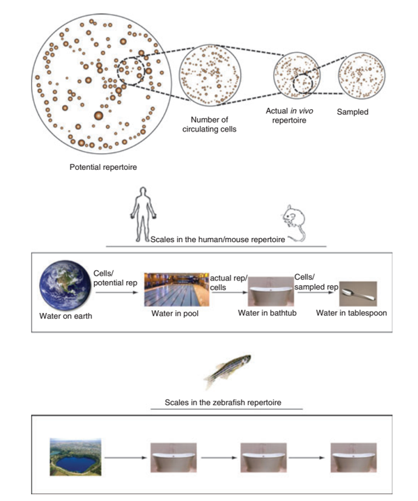

在大约60年前，统计学家费舍尔（Fisher）确定了类似问题的解决方案，主要是基于capture–recapture方法上的泊松分布估计 <sup><a href='#ref7'>[7]</a></sup>：

目前repertoires diversity 的估计存在不准确性的原因：

> - 免疫组库多样性估计的一种常用方式便是估计唯一V（D）J组合的数量，然而由于受体多样性的产生除了VDJ重组之外，也包括核苷酸插入和缺失（indels）和体细胞超突变产生的，因此这些估计仅是可能组合实际数目的下限；
>
> - 大多数研究集中在免疫受体的单链上，因此仅描述了通过构建异二聚体的两条链的组合获得的总多样性的一部分；

<a name="loss-diversity-in-sick-status"><h4>疾病状态下的多样性缺失 [<sup>目录</sup>](#content)</h4></a>

韩健在09年西雅图免疫年会上，报告了免疫组库在肿瘤病人中有明显的多样性缺失的现象：

<p align='center'></p>

如上面的幻灯片所示，正常人的免疫组库（T细胞beta受体）多样性很好，在三维图像上看起来丛林密布；而结肠癌病人或系统性红斑狼疮病人的免疫组库则多 样性缺失，三维图像看上去就是几棵树。这些病人T细胞总数是正常的，可是他们的T细胞功能太专一，缺乏健康人应有的多样性

<a name="common-used-diversity-statistics"><h4>常用的多样性指标 [<sup>目录</sup>](#content)</h4></a>

VDJtools中提供的多样性指标：

> - Observed diversity, the total number of clonotypes in a sample
Lower bound total diversity (LBTD) estimates
>
>    - Chao estimate (denoted chao1)
>    - Efron-Thisted estimate
> - Diversity indices
>
>    - Shannon-Wiener index. The exponent of clonotype frequency distribution entropy is returned.
>
>    - Normalized Shannon-Wiener index. Normalized (divided by log[number of clonotypes]) entropy of clonotype frequency distribution. Note that plain entropy is returned, not its exponent.
>
>	- Inverse Simpson index
>
> - Extrapolated Chao diversity estimate, denoted chaoE here.
>
> - The d50 index, a recently developed immune diversity estimate
>
>	有韩健等提出的多样性指标
>
>	“所谓D50，就是通过arm-PCR技术扩增免疫组库然后测序。把半定量扩增出的免疫组库和测序结果做sorting, 表达量最高到表达量最低排列，然后从高到低地相加。加到50%（reads)的时候看看一共包括多少个克隆，克隆数占总数的百分比就是D50值。
>		
>	一个健康 人，因为免疫组库多样性好，免疫细胞总数的50%就会由许多不同的细胞组成，D50值就会偏高；相反，病人常常会有克隆性扩增，免疫多样性差，所以几个克 隆就占据了免疫细胞的50%了，因此D50值就偏低。”
>
>	<p align='right'><a href='http://blog.sciencenet.cn/blog-290052-405367.html'>——韩健blog</a></p>

Diversity estimates are computed in **two modes**: using original data and via several re-sampling steps (usually down-sampling to the size of smallest dataset).

> - The estimates computed on original data could be biased by uneven sampling depth (sample size), of those only chaoE is properly normalized to be compared between samples. While not good for between-sample comparison, the LBTD estimates provided for original data are most useful for studying the fundamental properties of repertoires under study, i.e. to answer the question how large the repertoire diversity of an entire organism could be.
>
> - Estimates computed using re-sampling are useful for between-sample comparison, e.g. we have successfully used the re-sampled (normalized) observed diversity to measure the repertoire aging trends (see this paper).

An additional complication in interpreting measurements of diversity is that the measures are **strongly influenced by the large numbers of rare species** (often present only once) that are typically observed in a repertoire sample, and which are themselves dependent on sequencing error and the accuracy of the algorithms used to correct this

尽管多样性分析由于取样代表性问题以及低丰度克隆带来的评估的准确性问题，但是它仍然对疾病状态的研究提供了许多有用的信息：

> [J Allergy Clin Immunol. 2014 Apr; 133(4):1109-15.](https://www.ncbi.nlm.nih.gov/pubmed/24406074/)
>
> [Genome Med. 2015; 7(1):49.](https://www.ncbi.nlm.nih.gov/pubmed/26140055/)

<a name="differece-in-vdj-reconbination"><h3>VDJ重组差异 [<sup>目录</sup>](#content)</h3></a>

Analysis by our laboratory and by others of germline VH, Vκ and Vλ segment usage and frequencies of recombination between particular V-D and D-J segments in the naive BCR repertoire revealed a marked skewing that in turn then shapes the repertoire in mature, antigen-experienced B cells

> Ippolito, G.C. et al. Forced usage of positively charged amino acids in immunoglobulin CDR-H3 impairs B cell development and antibody production. J. Exp. Med. 203, 1567–1578 (2006).
>
> Boyd, S.D. et al. Individual variation in the germline Ig gene repertoire inferred from variable region gene rearrangements. J. Immunol. 184, 6986–6992 (2010).
>
> Boyd, S.D. et al. Measurement and clinical monitoring of human lymphocyte clonality by massively parallel VDJ pyrosequencing. Sci. Transl. Med. 1, 12ra23 (2009).
>
> Larimore, K., McCormick, M.W., Robins, H.S. & Greenberg, P.D. Shaping of human germline IgH repertoires revealed by deep sequencing. J. Immunol. 189, 3221–3230 (2012).

我们也和其它科学家一样，试图通过多做一些病人标本找到更特异性的免疫组库变化：某个特定的VDJ重组总是和某个肿瘤相关。可是，免疫系统潜在的多样性（人可以有10的20次方那么多不同的T细胞）实在太大，找到病人之间共有的特异性VDJ (或者CDR3)可能性很小

<p align='right'><a href='http://blog.sciencenet.cn/blog-290052-405367.html'>——韩健blog</a></p>

<a name="public-or-private-T-cells"><h3>Public or private T cells [<sup>目录</sup>](#content)</h3></a>

Public T cells, which are identical T-cell clonotypes shared among individuals, have been a curiosity for some time given the incredibly low likelihood of identical TCRs being generated in separate individuals by chance.

TCR-seq studies have revealed that public T cells are actually commonplace ([1](https://www.ncbi.nlm.nih.gov/pubmed/21349924/), [2](https://www.ncbi.nlm.nih.gov/pubmed/20811043/), [3](https://www.ncbi.nlm.nih.gov/pubmed/21383244/), [4](https://www.ncbi.nlm.nih.gov/pubmed/17130450/)) and result from the increased generation probability of these shared TCR specificities across individuals [29], as well as the fact that different TCR nucleotide sequences can code for the same TCR amino acid sequence, because of the degeneracy of the genetic code

<p align='right'>——<a href='https://www.ncbi.nlm.nih.gov/pubmed/24172704'>Genome Med. 2013 Oct 30;5(10):98.</a></p>


<a name="clone-convergence"><h3>克隆融合度（convergence）或者称为简并性 [<sup>目录</sup>](#content)</h3></a>

融合度：从多个核苷酸序列翻译出相同的氨基酸序列

Freeman JD, Warren RL, Webb JR at al. Profiling the T-cell receptor beta-chain repertoire by massively parallel sequencing. Genome Res. 2009 Oct; 19(10):1817-24.

<a name="not-random-for-repertoires"><h3>免疫组库多样性产生的非随机性 [<sup>目录</sup>](#content)</h3></a>

> Vβ-Jβ组合的频率在naive T细胞和记忆T细胞之间存在着明显的差异 <sup><a href='#ref8'>[8]</a></sup>；
>
> 基于对V-D-J基因片段之间的组合形式的分析发现：Vβ-Dβ重组倾向于随机，而Dβ-Jβ的组合的随机性不够明显 <sup><a href='#ref8'>[8]</a></sup>；
>
> CDR3序列的频率和在Vβ-Dβ或Dβ-Jβ之间的插入量之间有很强的负相关性，即高频CDR3通常在那些连接中包含较少的插入事件；
>
> 不同个体的免疫组库的相似性高于随机期望 <sup><a href='#ref8'>[8]</a></sup>。例如，一项针对naive CD8+ T细胞的研究表明，在任意两个个体中，其重叠程度都比均匀分布的随机库大7000倍；

以上的种种都表明 IgH/TCRB 存在序列选择的非随机性，在某种程度上有一定收敛规律，这种现象可以被克隆融合度或简并性部分解释：

> 多个重组事件可能产生相同的核苷酸序列，而多核苷酸序列可以翻译为相同的氨基酸序列


<a name="repertoire-bias"><h3>Repertoire Bias [<sup>目录</sup>](#content)</h3></a>


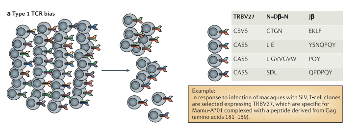

responding T cells in an individual use **the same TCR α-chain variable (Vα) region or β-chain variable (Vβ) region**, but have little or no similarity in the complementarity-determining region 3 (CDR3)- or junctional (J)-region sequences

即仅在VJ片段的重组来源上一致

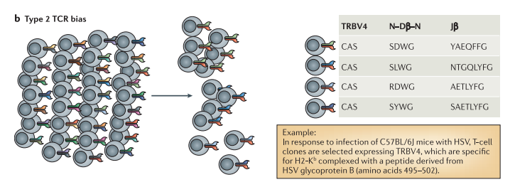

responding T cells in an individual use the **same TCR Vα or Vβ region**, and also share amino acids at the same position in the CDR3 region (**a CDR3 motif**). The motif can be as small as one amino acid, or as large as four amino acids

The example shown here comprises a two amino-acid motif, WG

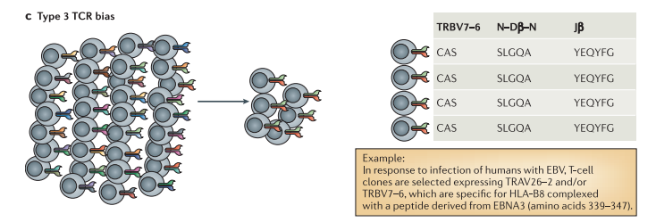

responding T cells in an individual use the same TCR Vα or Vβ region, CDR3 and J-region sequence. It can refer to a single TCR α- or β-chain, or both

即完全相同

那么Repertoire Bias对个体免疫力来说，是好是坏？

> C57BL / 6J小鼠的野生型 H2-K<sup>b</sup> 和突变型 H2-K<sup>bm8</sup> 对单纯疱疹病毒糖蛋白B（HSV gB）提呈相同的抗原肽SL8（HSV gB氨基酸序列的495-502位，SSIEFARL，表示为SL8）
>
> 对这两种小鼠施加HSV gB刺激，H2-K<sup>b</sup> 型表现出较强的易感性，而突变型H2-K<sup>bm8</sup>具有抗性，分析它们的免疫组库的组成发现：
>
> - 表现出较强易感性的 H2-K<sup>b</sup> 型小鼠，其被 SL8-H2-K<sup>b</sup> 特异性选择出来的TCR克隆型具有TRBV4 bias，且在CDR3β有保守WG基序（符合上述的Type2 TCR bias）；
>
> - 具有抗性的 H2-K<sup>bm8</sup> 型小鼠，其被 SL8-H2-K<sup>bm8</sup> 特异性选择出来的TCR克隆型具有更高的多样性，且有更强的亲和力；
>
> 结构分析表明，SL8肽在 H2-K<sup>b</sup> 和 H2-K<sup>bm8</sup> 分子凹槽中的结合形态看起来几乎相同。然而，H2-K<sup>bm8</sup> 的肽结合槽中的多态性残基使其构象发生改变，导致MHC分子α1-螺旋表面62位上的精氨酸残基的侧链获得更稳定的构象，在不存在TCR连接的情况下，这种稳定作用是显而易见的。因此，在SL8–H2-K bm8复合物中Arg62的迁移性降低，使得从幼稚的TCR库中选择的一系列特定TCR（更多样化）可以实现更大的TCR接触（更高的亲和力）
>
> 鉴于一般认为TCR亲和力与功能能力正相关，因此，更多样化，更高亲和力 SL8–H2-K<sup>bm8</sup> 特异性T细胞库比更严格，“质量”较低的 SL8–H2-K<sup>b</sup> 特异性T细胞反应在控制HSV感染方面更好

由此，我们可以从这个示例中得出一个结论：Repertoire Bias不利于个体免疫力

另外一个例子：

> 对于MHC I型基因型为Mamu-A*01的猴子，面对SIV（猿猴免疫缺陷病毒）的侵染，会对两个病毒蛋白Tat和Gag，分别提呈抗原肽TL8和CM9，对TL8-MHCI和CM9-MHCI响应的CD8+T细胞分别存在TRBV6-5和TRBV27的选择偏好性
>
> TL8-MHCI -> TRBV6-5 : Type 2 TCR bias
>
> CM9-MHCI -> TRBV27 : Type 1 TCR bias
>
> 不同的TCR bias导致它们在面对病毒突变逃逸时，表现出不同的灵活性：
>
> - TL8–Mamu-A*01特异性TCR谱系更为有限，缺乏灵活性来应对TL8表位的细微结构变异
>
> - 更多样化的CM9–Mamu-A*01特异性TCR可能保留识别表位变异的能力，从而阻止了突变病毒的选择

<a name="analysis-based-on-network-construction"><h3>基于网络的分析方法 [<sup>目录</sup>](#content)</h3></a>

从网络体系结构的角度研究许多结构特征，可能有助于更好地了解免疫反应的动态过程

网络架构在表型分类，出现和功能方面的重要性，例如：蛋白质在蛋白质相互作用网络中的拓扑突出性能够预示其生物学重要性

一般来说，我们希望了解的是： **生物系统（网络）的哪些部分容易受到扰动的影响？** 网络中生物分子及其相互作用的显著变化，形成差异性网络（Differential Network），这种差异性变化对细胞信号的转导、细胞发育、环境压力、药物治疗以及疾病状态的转变具有重要的价值

生物网络存在的特点：

> - **网络的边具有不确定性**：生物分子之间的相互作用并不是一成不变的，反映在基因调控网络上，则节点之间的边会因时间、空间或外部环境的变化而发生变化，或者说生物网络的边具有不确定性，只以一定的概率存在，在特点的情况下，生物网络具有“重布线”的能力；
>
> - **网络拓扑具有典型的属性依赖关系**：网络中不仅节点之间存在依赖关系，边之间也存在依赖关系，即一种调控关系的出现或消失往往伴随着其他调控关系的消失和出现；

差异网络分析的一般思路和存在的问题：

> - 一般思路：
>
>   类似于差异表达分析，差异网络分析主要针对不同实验条件下的两个网络的“减法”过程，该减法过程过滤了普遍存在的相互作用（即“看家”作用），通过选择性地提取相关研究条件或表型的相互作用，降低了代表性静态网络的复杂性
>
> - 存在的问题：
>
>   （1）差异性网络分析致力于网络的动态“重布线（rewiring）”，这于静态网络是无法完成的；
>
>   （2）由于生物网络具有上述的两个特征——网络边的不确定性和网络拓扑具有属性依赖关系，简单地进行“减法”很难完成差异性的度量；

大多数的生物网络差异性的分析方法依赖于不同的相关性来衡量网络中顶点对之间的关联强度，其研究的重点在于 **相关性的度量** 和 **差异性指标的提取** 、差异性度量方法和先验知识的融合

网络分析中的中心度分析（centrality analysis）：

一网络的中心指数（centrality indices）包括：网络中每个节点（vertex）的连接度（Degree）和顶点间度（Betweenness ）

> - 顶点连接度（Degree）：与该顶点产生物理连接的边的数量
>
> - 顶点间度（Betweenness ）：该顶点所处的最短路径的数量，或者说是经过该节点的所有可达节点对中最短路径的比例，某一点的顶点间度越高表示该顶点是许多最短路径的必经入路，正所谓“咽喉要道”“一夫当关万夫莫开”，则它的全局网络结构中的中心度越高；

待看的文章：

[BMC Syst Biol. doi: 10.1186/1752-0509-5-27](https://www.ncbi.nlm.nih.gov/pmc/articles/PMC3047437/)

[Nat Com. doi: 10.1038/s41467-019-09278-8](https://www.ncbi.nlm.nih.gov/pmc/articles/PMC6428871/)

可以将免疫组库中（单个样本或多个样本）的克隆用图的形式组织起来：

<p align="center"></p>

图中的每个节点表示一种TCR克隆（用氨基酸序列的唯一性来定义克隆），边表示所连接的两个克隆的氨基酸替换差异小于某一个固定阈值(上图设置的阈值为3个氨基酸差异)

> 上图的额外说明：
>
> 上图的节点表示的克隆根据其抗原表位特异性，填充不同的颜色：
>
> - 红：FRDYVDRFYKTLRAEQASQE (HIV-1/Gag)
> - 蓝：GLCTLVAML (EBV/BMLF1)
> - 绿：KRWIILGLNK (HIV-1/Gag)
> - 紫：NLVPMVATV (CMV/pp65)
> - 灰：其他
>
> 从图中可以看出：相同抗原特异性的不同克隆之间倾向于有更多的连接，即它们之间的氨基酸序列相似更高，在图中基本聚到了一起
>
> 对抗原特异性是否相同的边，分别统计它们的汉明距离：
>
> <p align="center"></p>
>
> 发现相同抗原特异性的不同克隆之间倾向于有更近的汉明距离


<a name="properties-of-a-healthy-repertoire"><h3>健康个体的免疫组库 [<sup>目录</sup>](#content)</h3></a>

- **TCR的多样性/克隆种类**

	TCR β的CDR3序列，长度为45bp，其最大可能的容量为4<sup>45</sup>，考虑一些已知的限制因素，它理论上的多样性也能达到10<sup>11</sup>，然而实际上T细胞在胸腺成熟的过程中要经历两个选择过程：
	
	> - 阳性选择：留下那些能与自身MHC结合的T细胞克隆
	> - 阴性选择：消除那些与自身MHC结合能力过强的T细胞克隆
	
	只有经过这两步筛选，才能产生成熟的且具有功能的T细胞，并进入外周血然后分散到各个组织器官中，因此实际上产生的成熟的T细胞克隆的种类要远远少于理论值
	
	在1999年的Science文章中，有人基于Vβ18 和 Jβ1.4 subset抽样推断，认为TCR β的克隆种类大概为10<sup>6</sup>
	
	2009年，基于深度的TCR-seq和unseen species model，推断TCR β的克隆种类大概为3-4 million，目前对个体进行全面深度的TCR-seq的研究得出结论，一个健康个体大概有**1.3 million**的distinct TCR β chain sequences

- **个体内不同的TCR克隆，其丰度有数量级上的差异**

- **样本间共享的TCR克隆**

	**Public T cells**：个体间共有的相同的T细胞克隆型，由于不同个体偶然产生相同的TCR的可能性极低，一段时间以来，它们一直是一种稀奇的事物。
	
	若按照随机事件来看，两个个体之间出现相同克隆是一个小概率事件，但是实际检测出来的共享克隆的发生概率比随机期望高了上千倍

	TCR-seq研究表明，公共T细胞实际上是常见的，这是由于这些跨个体共享的TCR特异性的产生概率增加，以及由于遗传密码的简并，不同的TCR核苷酸序列可以编码相同的TCR氨基酸序列。一个人共有的TCR库所占比例已被证明高达14%，而共有TCR库的真实程度可能还要高得多

	简单来说，就是任意两个健康个体，它们之间共享的TCR克隆种类大约占到各自总克隆种类的14%，两个个体间的共享克隆常见但不多，但是两个以上个体间的共享克隆则少之又少，甚至根本没有

	因此想要通过**比较两组样本间某个克隆的丰度是否存在显著差异基本是不可能的**：若control组和case组各有3个样本，要比较的克隆只在其中的一个或两个样本中有检测到（绝大多数克隆都是这种情况），此时根本无法进行比较！

	有一种解释是，其实不同个体之间的共享克隆很高，只是你检测不到而已
	
	> 其实在每个个体的 naive T 库中都随时在产生着丰富多样的T细胞克隆类型（T细胞克隆类型由TCR决定），因为其足够丰富，丰富到 naive T 库的容量几乎达到甚至已经超过它可能产生的克隆类型的总量，那么此时大部分的TCRβ在不同个体间，不论什么时刻什么生理状态下，都是共享的，但是此时每种T细胞克隆几乎都是微量的，或者说是单克隆。
	>
	> 当个体被暴露在某种特定的抗原环境下，针对这种特定抗原的TCR识别MHC-抗原复合物（antigen–MHC complex），使得带有这种TCR的T细胞克隆增殖发生克隆扩张（clonal expansion），那么它在整个T细胞库中的比例就会显著增加，而从外周血取样也只是对T细胞库进行抽样测序，比例高的T细胞克隆类型相对于其他克隆类型当然更容易被检测到。
	> 
	> 因此，若两个个体同时都暴露在一种抗原环境下，针对这种抗原的T细胞克隆有很大可能性会在这两个个体中被检测到，而被鉴定为共享克隆，而如果两个个体没有接触或没有同时接触到这种抗原，则从他们中都检测到对应抗体克隆类型的可能性就偏低，从而有很大可能性被鉴定为非共享克隆，但实际上这种克隆类型有很大可能性在两者体内都有

<a name="ultra-sensitive-detection-of-rare-T-cell-clones"><h3>对低丰度的T细胞克隆具有极高的灵敏度 [<sup>目录</sup>](#content)</h3></a>


在相同的T细胞克隆的混合背景（1 million) 中添加不同量的已知的T细胞克隆作为spike-in

<p align="center"></p>

其中D克隆在Mix3和G克隆在Mix1中的量最少，都只有10个，但都在后续的分析中成功检测到，说明：**免疫组库测序对低丰度的T细胞克隆具有极高的灵敏**

实际检测到频率与期望的频率基本都十分相近

<p align="center"></p>

<a name="machine-learning-application-in-immune-repertoire"><h2>免疫组库机器学习方法 [<sup>目录</sup>](#content)</h2></a>

- [BMC Bioinformatics. 2017; 18: 401.](https://www.ncbi.nlm.nih.gov/pmc/articles/PMC5588725/)

use the biochemical features encoded by the complementarity determining region 3 of each B cell receptor heavy chain in every patient repertoire as input to a detector function, which is fit to give the correct diagnosis for each patient using maximum likelihood optimization methods. The resulting statistical classifier assigns patients to one of two diagnosis categories, RRMS or other neurological disease, with 87% accuracy by leave-one-out cross-validation on training data (N = 23) and 72% accuracy on unused data from a separate study (N = 102)

<p align='center'></p>

<p align='center'></p>

<p align='center'></p>

<a name="basic-analysis-and-analysis-tools"><h2>TCR/BCR的基础分析及分析工具 [<sup>目录</sup>](#content)</h2></a>

免疫组库数据分析领域的现状和存在的问题：

- 能对单个样本逐一进行详尽的分析，但是多个样本间的比较分析，需要在单样本分析结果基础上作进一步的处理，例如标准化；

- TCR/BCR多样性极端高，可类比于16s分析，但是其注释程度远没有16s领域详尽；

- 目前免疫组库分析主要切入点有：

    - 跟踪个体的克隆型变化；
    - 比较V、D、J基因片段的使用偏好情况；
    - 比较个体间免疫组多样性的差异，或者同一个体某一过程中免疫组库多样性的变化；

    但是目前这些常规分析大都使用的是内部的自建脚本，标准不统一，难以比较和重复

<a name="vdjtools"><h3>VDJtools [<sup>目录</sup>](#content)</h3></a>

工具文章  <sup><a href='#ref9'>[9]</a></sup>：

<a name="functions-of-vdjtools"><h4>功能 [<sup>目录</sup>](#content)</h4></a>

<a name="simple-outline-of-functions"><h5>简要概览 [<sup>目录</sup>](#content)</h5></a>


包含6个功能模块：

Basic analysis

> - `CalcBasicStats` Computes summary statistics for samples: read counts, mean clonotype sizes, number of non-functional clonotypes, etc
>
> 
> - `CalcSegmentUsage` Computes Variable (V) and Joining (J) segment usage profiles
>
> - `CalcSpectratype` Computes spectratype, the distribution of clonotype abundance by CDR3 sequence length
>
> - `PlotFancySpectratype` Plots spectratype explicitly showing top N clonotypes
>
> - `PlotFancyVJUsage` Plots the frequency of different V-J pairings
>
> - `PlotSpectratypeV` Plots distribution of V segment abundance by resulting CDR3 sequence length

<a name="details-for-individual-function"><h5>详细举例 [<sup>目录</sup>](#content)</h5></a>

<a name="basic-analysis"><h6>Basic analysis [<sup>目录</sup>](#content)</h6></a>

**(1) CalcBasicStats**

This routine computes a set of basic sample statistics, such as read counts, number of clonotypes, etc

|	Column	|	Description	|
|:---|:---|
|	sample_id	|	Sample unique identifier	|
|	…	|	Metadata columns. See Metadata section	|
|	count	|	Number of reads in a given sample	|
|	diversity	|	Number of clonotypes in a given sample	|
|	mean_frequency	|	Mean clonotype frequency	|
|	geomean_frequency	|	Geometric mean of clonotype frequency	|
|	nc_diversity	|	Number of non-coding clonotypes	|
|	nc_frequency	|	Frequency of reads that belong to non-coding clonotypes	|
|	mean_cdr3nt_length	|	Mean length of CDR3 nucleotide sequence. Weighted by clonotype frequency	|
|	mean_insert_size	|	Mean number of inserted random nucleotides in CDR3 sequence. Characterizes V-J insert for receptor chains without D segment, or a sum of V-D and D-J insert sizes	|
|	mean_ndn_size	|	Mean number of nucleotides that lie between V and J segment sequences in CDR3	|
|	convergence	|	Mean number of unique CDR3 nucleotide sequences that code for the same CDR3 amino acid sequence	|

**(2) CalcSegmentUsage**

This routine computes Variable (V) and Joining (J) segment usage vectors, i.e. the frequency of associated reads for each of V/J segments present in sample(s). If plotting is on, will also perform clustering for V/J usage vectors

|	Column	|	Description	|
|:---|:---|
|	sample_id	|	Sample unique identifier	|
|	…	|	Metadata columns. See Metadata section	|
|	Segment name, e.g. TRBJ1-1	|	Segment frequency in a given sample	|
|	Next segment name, e.g. TRBJ1-2	|	…	|
|	…	|	…	|


**(3) CalcSpectratype**

Calculates spectratype, that is, histogram of read counts by CDR3 nucleotide length. The spectratype is useful to detect pathological and highly clonal repertoires, as the spectratype of non-expanded T- and B-cells has a symmetric gaussian-like distribution.

|	Column	|	Description	|
|:---|:---|
|	sample_id	|	Sample unique identifier	|
|	…	|	Metadata columns. See Metadata section	|
|	CDR3 length, e.g. 22	|	Frequency of reads with a given CDR3 length in a given sample	|
|	Next CDR3 length, 23	|	…	|
|	…	|	…	|

**(4) PlotFancySpectratype**

Plots a spectratype that also displays CDR3 lengths for top N clonotypes in a given sample. This plot allows to detect the highly-expanded clonotypes.

|	Column	|	Description	|
|:---|:---|
|	Len	|	Length of CDR3 nucleotide sequence	|
|	Other	|	Frequency of clonotypes with a given CDR3 length, other than top N	|
|	Clonotype#N, e.g. CASRLLRAGSTEAFF	|	Clonotype frequency, at the corresponding CDR3 length	|
|	Clonotype#N-1	|	…	|
|	…	|	…	|

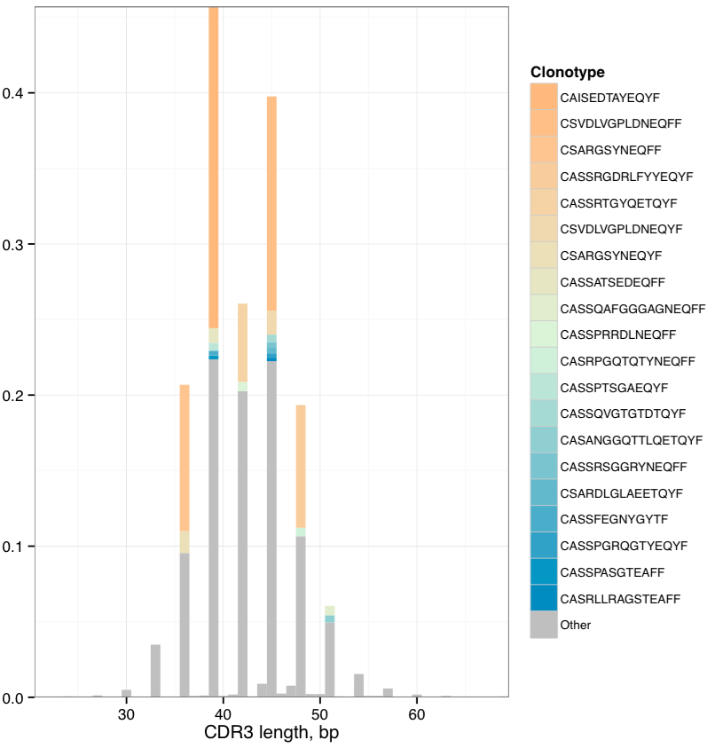

**(5) PlotFancyVJUsage**

Plots a circos-style V-J usage plot displaying the frequency of various V-J junctions

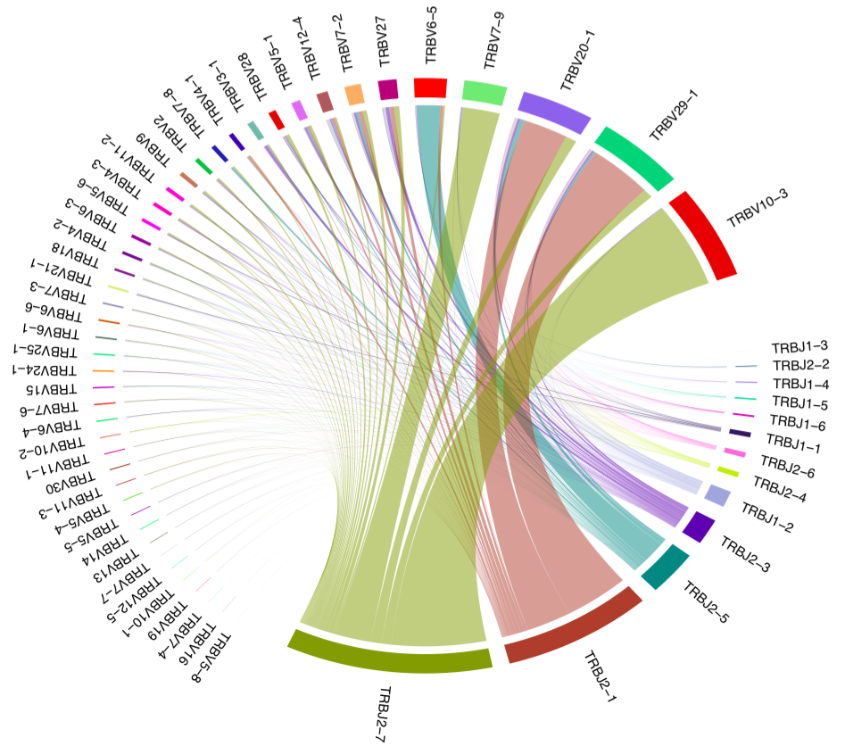

**(6) PlotSpectratypeV**

Plots a detailed spectratype containing additional info displays CDR3 length distribution for clonotypes from top N Variable segment families. This plot is useful to detect type 1 and type 2 repertoire biases, that could arise under pathological conditions.


<a name="diversity-estimation"><h6>Diversity estimation [<sup>目录</sup>](#content)</h6></a>

**(1) PlotQuantileStats**

画出的是一个像下面这样的圆环图：

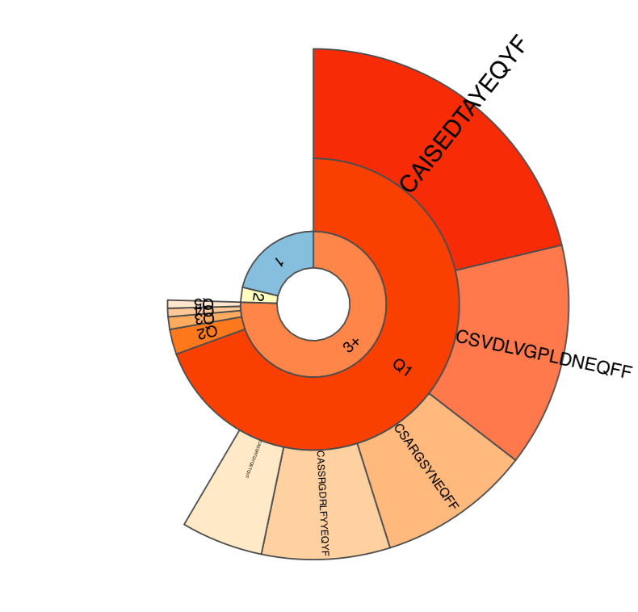

每一层的含义：

> - 第一层：singleton 、doubleton 和更高频的clonetype的频率分布。singleton 和 doubleton对多样性评估影响比较大，例如chao1，在【J Immunol. 2014 Mar 15;192(6):2689-98】这篇文章中发现singleton与naive T细胞的数量呈正相关，它们是免疫组库多样性的基础；
>
> - 第二层：“3+” set中丰度递减的克隆5个5等分部分克隆的各自丰度总会；
>
> - 第三层：丰度最高的N个克隆的各自丰度；

**(2) RarefactionPlot**

同时对多个样本进行稀疏曲线饱和度分析，从0到sample size进行抽样，得到实测的稀疏曲线，然后再以sample size最大的样本为基准，对sample size较小的样本进行稀疏曲线的外推补全

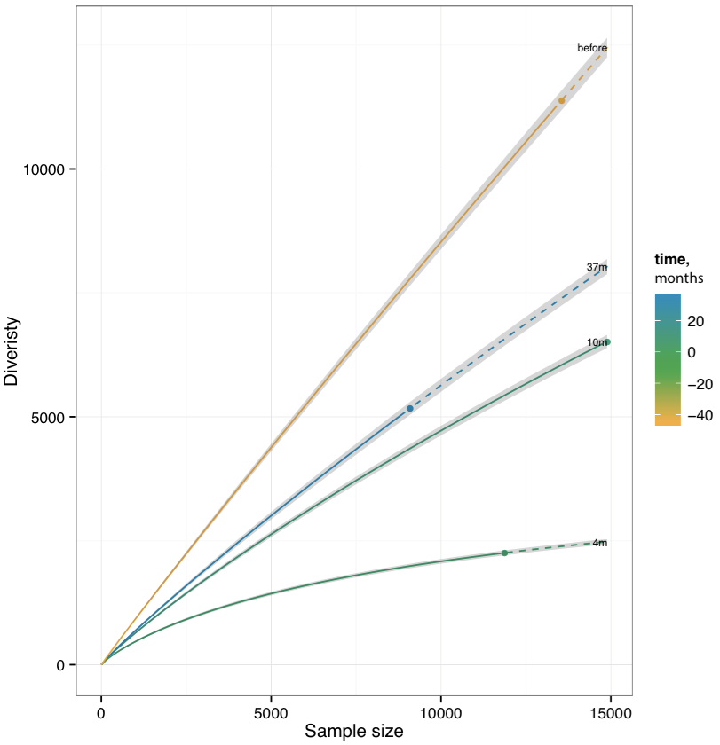

注：实线为实测稀疏曲线部分，虚线为推测部分

**(3) CalcDiversityStats**

它会计算多项多样性相关的统计量，包括：

> - Observed diversity, the total number of clonotypes in a sample
> - Lower bound total diversity (LBTD) estimates
>    - Chao estimate (denoted chao1)
>    - Efron-Thisted estimate
> - Diversity indices
>    - Shannon-Wiener index. The exponent of clonotype frequency distribution entropy is returned.
>    - Normalized Shannon-Wiener index. Normalized (divided by log[number of clonotypes]) entropy of clonotype frequency distribution. Note that plain entropy is returned, not its exponent.
>    - Inverse Simpson index
> - Extrapolated Chao diversity estimate, denoted chaoE here.
> - The d50 index, a recently developed immune diversity estimate

有两种计算模式：

- 基于原始数据的计算，这种多样性计算模式容易引入因为测序深度导致的bias，在这种模式下经过适当标准化之后的chaoE才能进行样本之间的比较——该模式下的计算结果将输出到；

- 基于重采样数据的计算，一般是在原始数据基础上的下采样，到最小的sample size


<a name="usage-of-vdjtools"><h4>使用 [<sup>目录</sup>](#content)</h4></a>

基本命令：

```
$ java -Xmx16G -jar vdjtools.jar RoutineName [arguments] -m metadata.txt output/prefix
```

在使用VDJtools进行分析之前，需要将上游分析工具的输出结果转换成VDJtools可接受的数据格式：

```
$ java -Xmx16G -jar vdjtools.jar Convert -S software -m metadata.txt ... output_dir/
```

VDJtools文件格式为：

|	column1	|	column2	|	column3	|	column4	|	column5	|	column6	|	column7	|	column8	|	column9	|	column10	|	column11 |
|:---|:---|:---|:---|:---|:---|:---|:---|:---|:---|:---|
|	count	|	frequency	|	CDR3nt	|	CDR3aa	|	V	|	D	|	J	|	Vend	|	Dstart	|	Dend	|	Jstart |
|	1176	|	9.90E-02	|	TGTGCCAGC…AAGCTTTCTTT	|	CAST…EAFF	|	TRBV12-4	|	TRBD1	|	TRBJ1-1	|	11	|	14	|	16	|	23 |

VDJtools运行对多个样本进行批量操作，此时需要用`-m`参数来指定多个样本的metadata，格式如下：

|	# file.name	|	sample.id	|	col.name	|	…	|
|:---|:---|:---|:---|
|	sample_1.txt	|	sample_1	|	A	|	…	|
|	sample_2.txt	|	sample_2	|	A	|	…	|
|	sample_3.txt	|	sample_3	|	B	|	…	|
|	sample_4.txt	|	sample_4	|	C	|	…	|
|	…	|	…	|	…	|	…	|

<a name="addition-informatics"><h2>附加信息 [<sup>目录</sup>](#content)</h2></a>

<a name="database-resource"><h3>* 数据库信息资源 [<sup>目录</sup>](#content)</h3></a>

- IMGT：http://www.imgt.org/

    只保存germline IG 和 TCR的序列和结构相关信息

- iEDB：http://www.iedb.org/

    专注于抗原肽表位的信息整理

- McPAS-TCR：http://friedmanlab.weizmann.ac.il/McPAS-TCR/

    搜集与病理相关的TCR序列，其中用NGS方法测出的免疫组库，将其中丰度最高的50种克隆认为它们与疾病状态相关

    <p align='center'></p>

- VDJdb：https://vdjdb.cdr3.net/

    整合了目前多个公开数据库和文献发表的TCR抗原特异性的信息，

    <p align='center'></p>

    该数据库还提供了一个基于VDJtools的在线注释工具[VDJmatch](https://github.com/antigenomics/vdjmatch)：对样本中的每种TCR克隆预测其抗原特异性

    VDJmatch也提供了本地化运行版本，不过它需要通过一个API与VDJdb进行交互查询，需要用户申请账号才能发起查询的申请

<a name="immune-and-cad"><h3>* 冠心病与免疫 [<sup>目录</sup>](#content)</h3></a>

研究表明几乎所有危险因素导致冠状动脉粥样硬化的过程中均与免疫学机制紧密相连

- 血脂代谢异常

    血脂代谢异常被认为是动脉粥样硬化发生的必要条件。当血浆**低密度脂蛋白浓度**升高时， 可通过穿胞作用滞留于血管内皮层，并经过**氧化修饰**形成脂过氧化物、磷脂化合物及羰基脂化合物。 这些脂类分子可以诱导巨噬细胞及血管壁细胞产生细胞黏附分子、化学因子及炎症介质，同时损伤血管内皮激活损伤—应答过程。

    此外**脂蛋白脱辅基蛋白部分也可以被修饰后产生自身抗原性**， 激活 T 细胞及抗原特异性免疫反应从而促进炎性细胞在粥样斑块原位聚集， 加剧脂类聚集、内皮功能异常及平滑肌增生， 加速粥样硬化的形成

    其他脂蛋白颗粒如:极低密度脂蛋白、中等密度脂蛋白同样可以被氧化修饰并激活免疫反应促进粥样斑块形成

- 炎症反应

    在高血压患者血管紧张素Ⅱ的升高非常普遍，它不但可以增加动脉内皮细胞及平滑肌细胞超氧化物阴离子的生成量，从而增加脂类物质的氧化修饰；还可以增加内皮细胞表面白细胞黏附分子的表达, 及血管平滑肌细胞间炎性细胞因子的表达

- 糖尿病所致的高血糖状态

    在糖尿病所致的高血糖状态下， 大分子物质可被修饰形成高级糖基化终产物。这些经修饰的大分子物质通过与内皮细胞表面的相应受体结合, 可增强内皮细胞在受到损伤后免疫应答过程中释放炎性细胞因子的能力，加之高血糖状态可以增强反应性氧及羰基基团的氧化损伤作用，在损伤— 应答两个方面加剧了粥样斑块形成

- 感染

    其机制可能是**病原体含有与宿主蛋白肽同源序列**，侵入的病原感染( 血管内或血管外) 诱发免疫反应，免疫产物不但针对病原体本身，同时也攻击含有交叉反应肽序列的宿主组织，血管内皮细胞即为攻击对象之一，从而引发了随后的粥样斑块形成。


直到几年前，动脉粥样硬化还被认为是“脂质存储疾病”，人们期望积极的药理治疗高胆固醇血症可以从根本上消除冠状动脉病变。然而，尽管针对经典危险因素进行了激烈的运动，但是心血管疾病仍然是全世界范围内的第一大死亡原因，在发展中国家的患病率正在上升。

该冠状动脉疾病可以被认为是炎症性紊乱的概念在90年代末。炎症在所有动脉粥样硬化形成步骤中起着关键作用：从泡沫细胞积累到脂肪条纹组织和纤维斑形成，直至急性斑裂，破裂和血栓形成

动脉粥样硬化过程的所有阶段可被视为到血管损伤（一种炎性应答）。包括常见的心血管危险因素（例如高血压，高血脂症，高血糖症和吸烟）在内的病理状况可以引发免疫反应，从而促进白细胞粘附分子和趋化因子的分泌，诱导单核细胞粘附于内皮细胞并迁移进入内膜下腔

<p align='center'></p>

最初的动脉粥样硬化病变始于单核细胞分化为巨噬细胞，巨噬细胞吞噬富含胆固醇的氧化低密度脂蛋白（LDL-ox），成为泡沫细胞，并组织成脂肪条纹

促炎性和氧化性动脉粥样硬化刺激的永存导致募集更多的巨噬细胞，肥大细胞以及活化的T细胞和B细胞，从而增加血管病变

<a name="diversity-metrics"><h3>* 多样性评估指标 [<sup>目录</sup>](#content)</h3></a>

$$D^{(\alpha)} = \left(\sum^S_{i=1}f_i^\alpha\right)^{\frac{1}{1-\alpha}} \tag{Hill diversity}$$

 where fi is the frequency of the ith clone weighted by the parameter α.

 Special cases of this Diversity function correspond to popular diversity indices in the immune repertoire field: 

 - species richness ($\alpha=0$)

- the exponential Shannon–Weiner ($\alpha\to 1$)

- the inverse of the Simpson index ($\alpha\to 2$)

- the Berger–Parker index ($\alpha\to \infin$)

The higher the value of α, the higher becomes the influence of the higher-abundance clones on the diversity

Owing to the mathematical properties of the diversity function (Schur concavity), two repertoires may yield qualitatively different αD values depending on the diversity index used

**Diversity profiles**, which are vectors of several diversity indices, have, therefore, been suggested to be superior to single diversity indices and are increasingly used in repertoire analyses

<p align='center'></p>

To quantify clonal expansion, diversity can be divided into evenness($D^α/D^0$) and species richness ($D^0$). Evenness ranges between 1 (uniform clonal population, every clone occurring in the frequency of $1/D^0$) and ≈ $1/D^0$, in which case one clone completely dominates the immune repertoire.

<a name="collection-of-enligtning-papers"><h3>* 文章收藏 [<sup>目录</sup>](#content)</h3></a>

最佳分析实战：

[G Yaari and SH Kleinstein. Practical guidelines for B-cell receptor repertoire sequencing analysis. Genome medicine, Nov 2015 20](https://www.ncbi.nlm.nih.gov/pubmed/26589402)

免疫组库测序技术的review：

> - [Boyd SD, Joshi SA. High-throughput DNA sequencing analysis of antibody repertoires. Microbiol Spectr. 2014;2.](https://www.ncbi.nlm.nih.gov/pubmed/26104353)
> - [Benichou J, Ben-Hamo R, Louzoun Y, Efroni S. Rep-seq: uncovering the immunological repertoire through next-generation sequencing. Immunology. 2012;135(3):183–91.](https://www.ncbi.nlm.nih.gov/pubmed/22043864)


---

参考资料：

(1) <a name='ref1'>Benichou J, Ben-Hamo R, Louzoun Y, Efroni S. Rep-Seq: uncovering the immunological repertoire through next-generation sequencing. Immunology. 2012 Mar;135(3):183-91. </a>

(2) <a name='ref2'>Quentin Marcou, Thierry Mora, and Aleksandra M. Walczak. High-throughput immune repertoire analysis with IGoR. Nat Commun. 2018; 9: 561. </a>

(3) <a name='ref3'>Zhang W , Du Y , Su Z , et al. IMonitor: A Robust Pipeline for TCR and BCR Repertoire Analysis[J]. Genetics, 2015, 201.  </a>

(4) [卢锐《Alpha多样性指数之Chao1指数 》](http://blog.sciencenet.cn/blog-2970729-1074963.html)

(5) <a name='ref4'>Chao, A. 1984. Non-parametric estimation of the number of classes in a population. Scandinavian Journal of Statistics 11, 265-270. </a>

(6) <a name='ref5'>Bolotin D et al. MiXCR: software for comprehensive adaptive immunity profiling. Nature Methods 12, no. 5 (2015): 380-381. </a>

(7) <a name='ref6'>Shugay M, Britanova OV, Merzlyak EM, et al. Towards error-free profiling of immune repertoires. Nat Methods. 2014 May 4 </a>

(8) <a name='ref7'>Fisher RA, Corbet AS, Williams C. The relation between the number of species and the number of individuals in a random sample of an animal population. J Anim Ecol. 1943;12:42–58. </a>

(9) <a name='ref8'>Robins HS, Campregher PV, Srivastava SK et al. Comprehensive assessment of T-cell receptor beta-chain diversity in alphabeta T cells. Blood. 2009 Nov 5; 114(19):4099-107. </a>

(7) Harlan Robins, Cindy Desmarais, Jessica Matthis, et al. Ultra-sensitive detection of rare T cell clones[J]. Journal of Immunological Methods, 2012, 375(1-2):14-19.

(8) Woodsworth DJ, Castellarin M, Holt RA. Sequence analysis of T-cell repertoires in health and disease. Genome Med. 2013;5(10):98. Published 2013 Oct 30. doi:10.1186/gm502

(9) Robins, H.S. et al. Overlap and effective size of the human CD8 + T cell receptor repertoire. Sci. Transl. Med. 2, 47ra64 (2010).

(10)  Emerson R O , Dewitt W S , Vignali M , et al. Immunosequencing identifies signatures of cytomegalovirus exposure history and HLA-mediated effects on the T cell repertoire[J]. Nature Genetics, 2017, 49(5):659-665.

(11) <a name='ref9'>Shugay M et al. VDJtools: Unifying Post-analysis of T Cell Receptor Repertoires. PLoS Comp Biol 2015; 11(11). </a>

(12) <a name='ref10'>Nguyen P1, Ma J, Pei D, Obert C et al. Identification of errors introduced during high throughput sequencing of the T cell receptor repertoire. BMC Genomics. 2011 Feb 11;12:106. doi: 10.1186/1471-2164-12-106. </a>
